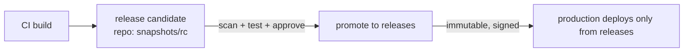

# Artifact Repositories

## What Is It?

An artifact repository is a **versioned warehouse for build outputs and dependencies** — the single source of truth for "what exists, what's in it, and where did it come from."

One product category, several formats: Maven repos (Artifactory/Nexus), container registries (Docker Registry, Harbor, ACR/ECR/GCR), npm/PyPI/NuGet proxies. Same concepts across all.

## Why Does It Exist?

CI (previous page) produces versioned artifacts — but artifacts on a build agent's disk are worthless: agents are ephemeral, disks vanish. The repository is the **durable memory of the delivery system**.

Three distinct jobs, one system:

```text
1. HOST    store your own artifacts        (shopeasy-payments 2.1.0)
2. PROXY   cache third-party dependencies  (log4j from Maven Central — once)
3. GATE    control what's trusted          (scanned, signed, policies)
```

The proxy job matters more than it looks: uncached dependency fetching makes every build internet-dependent and slow, and upstreams *disappear* (deleted packages, geo-blocks, supply-chain attacks — see the SBOM page).

## Layer 1 — Simple Explanation

The repository is the **restaurant's dry-storage room with a strict inventory system**:

- Everything shelved by exact label and date — nothing unlabeled enters, nothing relabeled after shelving (immutability)
- Supplies are bought from outside wholesalers, but stored locally (proxy) — so a wholesaler closing doesn't close your kitchen
- The head chef decides what's allowed on the shelves (policy gate)
- Anyone can fetch *exactly* what a dish used last Tuesday (reproducibility)

## Layer 2 — Engineer's View

**Immutability is the load-bearing wall.** A published version must never change content:

```text
✅ shopeasy-payments:2.1.0 = these bytes, forever
❌ "we patched 2.1.0 in place" — every audit, deployment, and forensic claim now lies
```

Mutable tags (`latest`, floating versions) break the traceability chain that runs artifact → build → commit → PR → work item (the SDLC's forensic spine). If you must re-issue, publish `2.1.1` — that's what SemVer is *for*.

**Retention and the storage-economics reality:**

- Every CI run produces an artifact; thousands of runs = terabytes
- Production-adjacent retention: keep deployable versions + tamper-evident audit trail; expire dev builds (e.g., "retain 30 days except promoted artifacts")
- Container layers deduplicate; JVM artifacts are tiny — retention policies differ per format

**Promotion model — the repository as delivery flow control:**



Promotion = same bytes move between repos/stages, never rebuilt. Rebuilding "for production" creates two artifacts that share a version but not a content — the original sin of delivery auditing.

**Metadata & provenance (bridge to Security phase):** modern repositories attach per-artifact metadata: build timestamp, git SHA, pipeline run, scan results, SBOM, signature (Sigstore/cosign). This metadata is what makes "is this artifact safe?" answerable *by a machine* at deploy time.

**Proxying as security posture:** internal builds should resolve third-party deps only via your proxy (allow-list policies, license filtering, CVE blocking at download time — shift-left at the *dependency acquisition* moment).

## Real-World Example (DevOps flavored)

Your daily infrastructure, named:

- **Azure Artifacts** feeds (`@snapshot`, `@release`), or Nexus/Artifactory for Maven/Gradle
- **ACR/ECR/Harbor** for images; quay for scanning + policy gates
- The classic incident this design prevents: "works in CI, fails in prod" because prod pulled `latest` which upstream silently changed — pin by digest, deploy only from the immutable `releases` repo
- The hygiene you audit: `docker pull` credentials scoped per pipeline (OIDC, not long-lived PATs), retention policies actually configured, snapshot versions never deployed to production

## Common Mistakes

- Deploying SNAPSHOT/mutable versions to production — unreproducible by definition
- No proxy: direct internet resolution in builds — flaky, slow, vulnerable to upstream deletions
- Infinite retention: cost explosion; zero retention: audits fail. Set deliberate policy
- Rebuilding between environments instead of promoting the same artifact
- Treating the repo as dumb storage — it's the enforcement point for scanning/signing gates
- Shared admin credentials for pushing artifacts — no attribution, no revocation

## Mental Model

> The artifact repository is the **evidence locker of your delivery system**. Every version that enters is sealed, labeled, and never altered; what production runs is *always* an exhibit from the locker, fully traceable back to the exact commit that created it.

## Remember This

1. Host + proxy + gate — three jobs, one system
2. Immutability of published versions is non-negotiable for traceability
3. Promote artifacts, never rebuild between environments
4. Proxying third-party deps = speed + availability + supply-chain control
5. Retention is a deliberate policy, not an accident
6. Per-artifact metadata (SHA, SBOM, signature) is what makes deploy-time security decisions possible

## One Sentence

An artifact repository is the immutable, versioned source of truth for everything your system builds and consumes — making deployments reproducible, dependencies controlled, and provenance provable.

## Knowledge Check

1. Why does promoting (not rebuilding) the same artifact to production matter for audits?
2. What breaks when a published version is mutated in place?
3. What are the repository's three jobs, and which one is most under-appreciated?
4. How does proxying third-party dependencies double as a security control?

## Further Reading

- Artifactory / Nexus repository management guides (concepts are vendor-neutral)
- [SLSA supply-chain framework](https://slsa.dev) — provenance concepts (returns in Security phase)

---

**← Previous:** [Continuous Integration](continuous-integration.md)
**Next:** [Continuous Delivery & Deployment](continuous-delivery.md) →
**Related:** [Build Automation](build-automation.md) · [SBOM & Supply Chain](../security/sbom-supply-chain.md)
