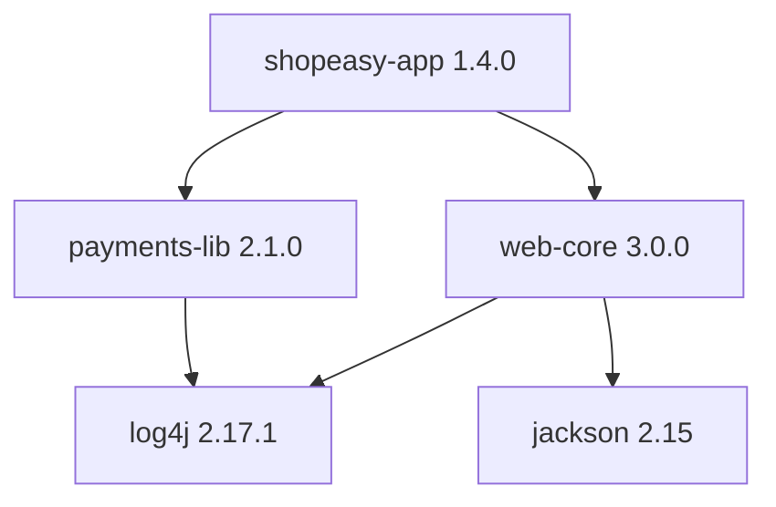

# Build Automation

## What Is It?

A **build tool** turns source code into a runnable, deployable **artifact** with one reproducible command — compiling, resolving dependencies, running tests, packaging, and stamping identity (version). Maven and Gradle for JVM, npm/pnpm for JS, Go modules, pip/poetry for Python — same concept, different ecosystems.

```text
source + dependencies + build definition (pom.xml / build.gradle)
              ↓  single command
      tested, versioned, signed artifact (JAR / image / wheel)
```

## Why Does It Exist?

Before build automation (imagine 1995), "building" was a ritual:

```bash
javac -cp lib/mail.jar:lib/log4j.jar:... src/com/shopeasy/**/*.java   # 40 minutes of typos
# manually copy files, zip them, name it "shopeasy-FINAL-v2-actually-final.jar"
# email it to the admin, who drops it on the server
```

Every machine built differently, every artifact was a snowflake, and "works on my machine" was a *build* problem, not a code problem. Build automation exists to make the build:

1. **Reproducible** — same input, same output, any machine
2. **Complete** — one command does everything
3. **Fast** — incremental compilation, dependency caching
4. **Dependency-aware** — fetch and resolve libraries automatically

## Layer 1 — Simple Explanation

A build tool is a **professional kitchen** vs cooking at home:

- The recipe (pom.xml) says exactly what ingredients (dependencies) and steps (phases) produce the dish
- The pantry (local repo `~/.m2`) stocks ingredients you've bought before — no re-downloading
- Any qualified cook (CI agent) following the same recipe produces the same dish
- The finished plate gets a label (version + checksum) before leaving the kitchen

## Layer 2 — Engineer's View

**The dependency graph is the real product.** Build tools are, at heart, *dependency resolvers*:



- Maven's coordinate system — `groupId:artifactId:version` — is the identity that made artifact repositories (next concept) possible
- **Transitive resolution:** you depend on A; A depends on B 1.2; the tool builds the whole graph. Version *conflicts* are resolved by rules (Maven: nearest-wins; Gradle: newest-wins) — this is why a security fix can be silently downgraded by a conflict rule (see SCA in the Security phase)

**Lifecycle vs task model:**

| | Maven | Gradle |
|---|---|---|
| Model | Fixed lifecycle (`compile → test → package → install → deploy`) | Task DAG you compose |
| Config | Declarative XML | Imperative script (Groovy/Kotlin) |
| Speed | OK (incremental since 3.9) | Strong (daemon, build cache, configuration cache) |
| Philosophy | Convention over configuration | Flexibility |

Same principles: **declarative desired state, reproducible execution, cached increments**. (Notice these exact ideas return as Terraform and Kubernetes — the declarative pattern is one of the course's through-lines.)

**What "reproducible" actually requires:**

1. Pinned dependency versions + lockfile (`gradle.lockfile`, `package-lock.json`) — ranges (`[1.0,2.0)`) are *non-reproducible by design*
2. Version from the build context (git tag/SHA), never hand-typed
3. No build-time dependence on the developer's machine (env vars, local JARs, "it needs my JDK")

**Determinism and caching in CI** — your actual job:

- Cache `~/.m2/repository` / `~/.gradle/caches` between pipeline runs: builds drop from 12 min to 90 s
- **Build cache reuse across agents** (Gradle remote cache): compile outputs shared across the team
- Daemon + warm agents; container images with the right JDK pre-baked (layer caching from the Containers phase)
- `mvn -pl module` / Gradle build avoidance: only rebuild changed modules in a mono-repo

## Real-World Example (DevOps flavored)

A production-grade pipeline stage:

```yaml
steps:
  - task: Cache@2          # restore ~/.m2
    inputs: { key: 'maven | "$(Agent.OS)" | **/pom.xml', path: ~/.m2/repository }
  - bash: mvn -B verify    # -B = batch, no progress spam in logs
  - bash: mvn -B deploy -DskipTests   # publish to artifact repo (next page)
```

The checks a DevOps engineer audits:

- Is the version derived from the git tag (traceability chain)?
- Is the dependency cache keyed on the lockfile (correct invalidation)?
- Is the artifact checksummed and signed at build time, not later?
- Does the same commit build byte-identically twice? (If not — non-reproducible — incident forensics gets shaky.)

## Common Mistakes

- Unpinned/range dependencies — yesterday's green build, today's mystery CVE (see also: `latest` tags)
- Builds that depend on developer-machine state (uncommitted local JARs, local settings)
- Rebuilding everything every commit — no caching strategy; slow CI kills TBD cadence
- Embedding secrets in the artifact at build time (they leak with every repo pull)
- Treating build config as "not code" — no review, no tests for the build itself
- Checking artifacts into Git (the object model punishes you forever — see Git Internals)

## Mental Model

> The build tool is the **factory production line** replacing artisan handcraft: same parts, same recipe, same output, any shift, any worker. The artifact repository (next page) is the finished-goods warehouse that the conveyor belt feeds.

## Remember This

1. One command → tested, versioned, deployable artifact — reproducibly
2. Build tools are dependency resolvers first; the coordinate system enables repositories
3. Lockfiles + version-from-git = reproducibility + traceability
4. Lifecycle (Maven) vs task DAG (Gradle) — declarative + cached in both
5. CI caching of dependency artifacts is the highest-ROI pipeline optimization
6. Conflict-resolution rules can silently override security versions — SCA exists for this

## One Sentence

Build automation converts source plus declared dependencies into a reproducible, versioned, tested artifact through a single command — making "works on my machine" irrelevant.

## Knowledge Check

1. Why are version ranges non-reproducible, and what replaces them?
2. Trace how a CVE fix can be silently downgraded by dependency conflict resolution.
3. What makes a build reproducible — list the three requirements.
4. Your CI build takes 14 minutes; the same local build takes 2. What's likely missing?

## Further Reading

- [Maven — Introduction to the Build Lifecycle](https://maven.apache.org/guides/introduction/introduction-to-the-lifecycle.html)
- [Gradle build cache docs](https://docs.gradle.org/current/userguide/build_cache.html)
- Reproducible Builds project (reproducible-builds.org)

---

**← Previous:** [Feature Flags](../development-practices/feature-flags.md)
**Next:** [Continuous Integration](continuous-integration.md) →
**Related:** [Artifact Repositories](artifact-repositories.md) · [Semantic Versioning](../development-practices/versioning.md)
