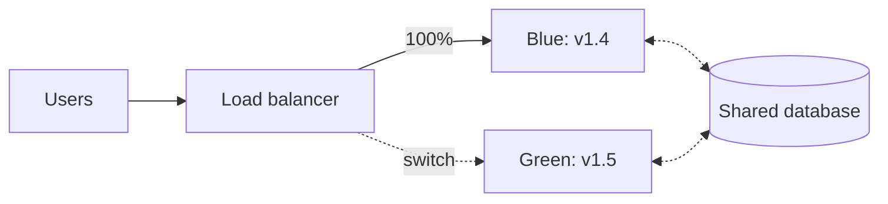

# Deployment Strategies

## What Is It?

A deployment strategy is **how new version replaces old version in production** — specifically, *how much traffic shifts, how fast, and how reversibly*.

| Strategy | Mechanics | Downtime | Risk blast radius | Cost |
|---|---|---|---|---|
| **Recreate (big-bang)** | Stop old, start new | Yes | 100% instantly | 1× |
| **Rolling** | Replace instances in batches | No | Grows gradually | ~1× |
| **Blue/Green** | Two full environments; flip traffic | No (flip) | 0→100% in one switch | 2× |
| **Canary** | Small % of traffic to new version | No | 1% → ramp | ~1× |

## Why Does It Exist?

Because the last page's promise — "release is boring" — has to survive *the moment of replacement*. Every deployment is a bet: new version is better everywhere, for everyone. Strategies exist to **shrink the bet**:

```text
Recreate:   bet everything, all at once
Rolling:    bet in slices, can't easily un-slice
Blue/Green: bet everything, but the exit door is one switch away
Canary:     bet 1% first, watch, then decide
```

## Layer 1 — Simple Explanation

Replacing a live service is like **changing a wheel on a moving car**:

- **Recreate:** stop the car (downtime), change the wheel, drive on. Simple; the passengers noticed.
- **Rolling:** swap one lug nut at a time per wheel while driving — careful sequencing, no stop.
- **Blue/Green:** build an identical second car driving alongside, then move all passengers across in one lane change. If the new car misbehaves, they change back.
- **Canary:** send 1% of passengers (or one specific bus route) to the new car first. If they arrive happy, ramp up.

## Layer 2 — Engineer's View

**Rolling update (the default in Kubernetes Deployments):**

```text
maxSurge: 25%        how many extra pods may exist during update
maxUnavailable: 25%  how many pods may be down during update
```

Batches replace old pods with new. Caveats: rollback = roll forward through another rolling update (slow); mixed versions coexist (schema/API compatibility required — your API must tolerate *both* versions simultaneously, the "expand-contract" pattern for databases).

**Blue/Green:**



Instant traffic cutover and instant revert. The costs people underestimate:

- **2× infrastructure** during the window
- **Database is shared** — schema changes can't be blue/green; migrations must be backwards-compatible (expand → migrate → contract)
- **Session/state drains:** in-flight work on blue when you flip

**Canary — the observability-dependent strategy:**

```text
deploy v1.5 alongside v1.4 → 1% traffic (hash-based, consistent)
        → compare canary vs control on: error rate, p95 latency, conversion
        → auto-promote 10% → 50% → 100%, or auto-rollback
```

Canary is only as good as its **decision signals**: without SLI dashboards comparing cohorts, a canary is a lottery ticket where you also choose to not notice losing. Tools: Argo Rollouts, Flagger, load-balancer weights, service mesh.

**Choosing (the decision table):**

| Situation | Strategy |
|---|---|
| Stateless service, good observability, frequent deploys | Canary |
| Need instant, binary revert; low infra cost sensitivity | Blue/Green |
| Large fleet, cost-sensitive, compatible versions | Rolling |
| Dev/test, small internal apps | Recreate is fine |
| Schema changes | None of these save you — expand/contract migrations |

**The meta-pattern:** all strategies are the same move — *decouple "new version exists" from "new version serves traffic"* — differing only in ramp function (step, instant, percentage). Feature flags (behavior) are the fourth dimension of the same idea.

## Real-World Example (DevOps flavored)

Kubernetes-native canary today is mostly not `Deployment` (which only does rolling) but **Argo Rollouts**:

```yaml
apiVersion: argoproj.io/v1alpha1
kind: Rollout
spec:
  strategy:
    canary:
      steps:
        - setWeight: 5
        - pause: { duration: 10m }   # analysis windows
        - setWeight: 25
        - pause: { duration: 10m }
        - setWeight: 100
```

Plus `Analysis` templates wired to Prometheus: `error_rate > 1%` in the canary cohort → automatic rollback, no human awake. This is the shift-right concept, mechanized.

Your operational checklist regardless of strategy: capacity headroom for the overlap window, DB compatibility verified, rollback *tested* (an untested rollback is a hypothesis), and dashboards segmented by version (averaging versions hides the canary's scream).

## Common Mistakes

- Canaries without cohort comparison — you deployed slower, not safer
- Random (non-hash) canary bucketing: users flip between versions per request
- Blue/green with incompatible schema on the shared DB — both colors break
- Ignoring long-tail requests during cutover (drain, don't drop)
- Never testing rollback in drills; discovering in the incident that it takes 40 minutes
- 1% canary for 30 seconds — too little traffic, too little time to catch anything real

## Mental Model

> Deployment strategies are **on-ramps to a highway**. Recreate closes the whole highway overnight. Rolling constricts lanes one at a time. Blue/green builds a parallel highway and swings the signage. Canary sends one bus over the new bridge first — and watches whether it falls.

## Remember This

1. All strategies decouple "deployed" from "serving traffic"; they differ in ramp function
2. Rolling = batch replace (K8s default); blue/green = instant flip at 2× cost; canary = percentage ramp
3. Canary is worthless without cohort-separated metrics and automated analysis
4. Schema changes defeat all strategies — compatibility must be designed in (expand/contract)
5. Rollback must be automated *and rehearsed*
6. Consistent (hash-based) traffic splitting keeps user experience coherent

## One Sentence

A deployment strategy controls how much production traffic your new version risks at a time — from all-at-once recreate to percentage-ramped canaries with automated rollback.

## Knowledge Check

1. Why does a shared database undermine blue/green, and what's the fix?
2. Your canary ran at 1% for 2 minutes and passed. What did you likely fail to detect?
3. Which strategy is a Kubernetes `Deployment` performing by default, and which knobs control it?
4. Explain "deploy, expose, release" as three switches and how each strategy touches them.

## Further Reading

- [Argo Rollouts docs](https://argo-rollouts.readthedocs.io/) — canary + analysis, the reference implementation
- *Continuous Delivery* — Humble & Farley (deployment patterns chapter)
- [Flagger docs](https://docs.flagger.app/)

---

**← Previous:** [Continuous Delivery & Deployment](continuous-delivery.md)
**Next:** [Pipeline as Product](pipeline-as-product.md) →
**Related:** [Feature Flags](../development-practices/feature-flags.md) · [Kubernetes Deployments](../kubernetes/deployments.md)
