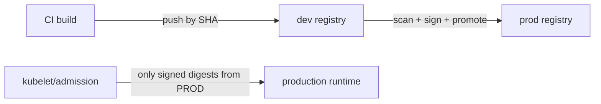

# Registries

## What Is It?

A container registry is an **artifact repository** (CI/CD phase) specialized for OCI images: content-addressed layer storage + the distribution API + pull/push auth. Docker Hub, GHCR, ACR/ECR/GCR, Harbor, Quay.

```text
image name anatomy:
registry.example.com/shop/payments:2.1.0@sha256:a1b2c3...
└───── host ──────┘ └ repository └ └ tag └└── digest (identity) ──┘
```

## Why Does It Exist?

Everything the artifact-repository concept delivered for JARs, registries deliver for images — plus one container-specific twist: **the registry is the deploy-time dependency**. Nodes pull images at pod-schedule time; registry availability, speed, and proximity are *production latency and availability* concerns, not CI conveniences.

## Layer 1 — Simple Explanation

The registry is the **warehouse with a smart loading dock**: boxes (layers) stored once and shared between shipments (images — manifests pointing at shared layers), identity by barcode (digest), and loading time that your delivery trucks (nodes) feel directly.

## Layer 2 — Engineer's View

**Content addressing in practice:** a manifest lists layer digests; identical layers across a thousand images are stored once (dedup, like Git objects). The digest is the verifiable identity — *what signature schemes sign* (cosign: "digest X is approved") and what admission controllers check.

**The registry as policy enforcement point (the gate pattern again):**



- **Separate dev/prod registries** (or at minimum promotion policies) — the Artifact Repositories page's promotion model
- **Admission control**: Kyverno/OPA/connaisseur verify signatures at deploy time — "run only what we signed"
- **Scan on push** (Trivy/Grype in Harbor/ACR) — the shift-left gate for images

**Geo-replication & availability (the deploy-latency angle):**

- Multi-region registries replicate manifests+layers; nodes pull from the near copy — or your 5-min scale-out waits on cross-ocean pulls
- **Pull-through caches / mirrors** for Docker Hub (rate limits are real; a CI fleet on anonymous Hub pulls *will* get throttled)
- Image size × node count = boot storms; slim images (Docker page) + Registry mirroring + K8s `imagePullProgressDeadline` awareness

**Access control models:**

| Consumers | Auth pattern |
|---|---|
| CI push | short-lived workload identity (OIDC — IAM page), never PATs on agents |
| kubelet pull | node identity or imagePullSecrets (scoped, rotatable) |
| humans | SSO, least-privilege, audit logging |

Anonymous public registries: an availability dependency and a supply-chain risk (tags move, images vanish — the `latest` page's lesson, weaponized). Mirror + pin what matters.

**Retention & cost:** layers are shared but manifests accumulate; every CI run pushing SHA-tagged images needs a GC policy ("keep last 30 per repo + anything deployed") — or storage grows forever and pulls slow down.

## Real-World Example (DevOps flavored)

ShopEasy's registry estate:

```text
ACR (premium, geo-replicated eu+us):  shop/* — prod images, signed, scanned-on-push
GHCR:                                 open-source images we consume, mirrored via pull-through
Retention:  30 days untagged, keep-all released digests
Promotion: cosign sign at CI → admission controller verifies digest+signature in prod
RBAC:      pipelines push via OIDC federation; kubelet via attached identity
```

The outage it prevents: Docker Hub rate-limiting during an incident scale-out — nodes unable to pull = pods Pending = the fire department arriving without water.

## Common Mistakes

- CI fleet on anonymous Docker Hub — the throttling time bomb
- `latest` or floating tags for anything deployable
- One flat "everything-public-ish" registry with shared admin creds
- No retention: terabytes of untagged manifests, slow garbage collection windows
- Signing existing but admission not enforcing it — theater, not gate
- Forgetting the registry in DR planning (nodes can't pull from a dead registry — replicate it)

## Mental Model

> The registry is the **warehouse your trucks load from at race time**: boxes shared across shipments, barcodes for identity, signatures as seals, mirrors as regional depots — and if the warehouse is slow or closed, your trucks sit loaded-but-empty on the grid. Treat its availability and speed as production SLAs, because they are.

## Remember This

1. Registry = artifact repository for OCI content: manifests → content-addressed layers
2. Digest is identity; tags are labels; signatures bind approvals to digests
3. Enforce at admission (signed-only) — the gate pattern, container edition
4. Geo-replicate/mirror for pull latency and Hub rate-limit immunity
5. OIDC for push, scoped pull creds, no shared admins
6. Retention policies + registry in DR scope

## One Sentence

A container registry is the content-addressed, policy-enforcing warehouse of the container supply chain — where image identity, promotion, scanning, and signing gate what production is allowed to run.

## Knowledge Check

1. Why is signature verification useless without admission enforcement?
2. Design the registry topology for a 2-region cluster fleet with strict prod separation.
3. What happens during an incident scale-out if the registry is single-region? Walk the failure.
4. Which credential should CI use to push, and which should nodes use to pull?

## Further Reading

- OCI distribution spec — the API every registry speaks
- Harbor docs (scanning, signing, replication — open-source reference)
- cosign / Sigstore docs (Security phase preview)

---

**← Previous:** [OCI & Runtimes](oci-runtimes.md)
**Next:** [Container Networking & Storage](networking-storage.md) →
**Related:** [Artifact Repositories](../cicd/artifact-repositories.md) · [Image security](../security/k8s-container-security.md)
