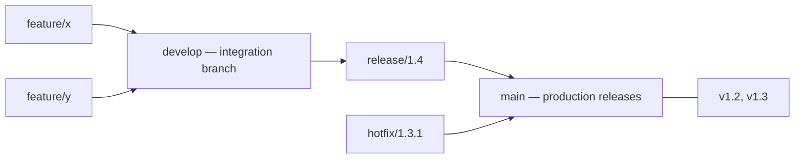

# Branching Strategies

## What Is It?

A branching strategy is a **team agreement about how commits flow from a developer's keyboard to the mainline** — which branches exist, who may write to them, and how work merges back.

Now that you know branches are free (Git Internals), the question becomes: *how do we use that freedom without chaos?*

## Why Does It Exist?

Free branching creates infinite shapes. Without an agreement:

- Long-lived branches diverge for weeks; merges become archaeology
- Nobody knows which branch is the truth
- "Integration day" becomes a weekly crisis
- Release branches accumulate cherry-picked hotfixes until nobody can reproduce production

The strategy exists to answer one question: **how long does a branch live, and how often does it integrate?** Everything else is detail.

## The Main Contenders

### 1. GitFlow (2010, Vincent Driessen)



| Branch | Purpose | Lifetime |
|---|---|---|
| `main` | What's in production | Forever |
| `develop` | Integration of completed features | Forever |
| `feature/*` | One feature | Days–weeks |
| `release/*` | Stabilization for a release | Days |
| `hotfix/*` | Urgent production fix | Hours–days |

**Built for:** the era of packaged software with scheduled releases (installers shipped to customers). Multiple supported versions in the wild need `hotfix/*` back-ports.

**Cost:** branches live long → merge conflicts, delayed integration, huge PRs. For web services deploying daily, it's bureaucratic anachronism.

### 2. GitHub Flow

```text
main is always deployable → branch → PR → review + CI → merge → deploy
```

One rule: `main` must always be deployable. Short-lived branches, everything else is tooling. For SaaS teams with CD, this is the baseline.

### 3. Trunk-Based Development

The strictest and (for CD teams) the strongest: **everyone commits to `main` (or near it), branches live less than a day**, incomplete features are hidden behind **feature flags**. Covered in depth in the next page.

## Layer 2 — Engineer's View — the real trade-off

All strategies trade the same two risks:

```text
Merge risk      ←————— spectrum —————→  Integration risk
(long-lived branches)              (commit straight to main)
```

- **Long-lived branches** defer integration → merge hell + big-bang risk
- **Direct-to-main** integrates instantly but risks breaking the line

The industry's resolution: **keep branches short AND protect main with automated gates** (CI must pass, review required). The branch lives a day; the pipeline substitutes for isolation. Trunk-based + CI + feature flags = integration risk ≈ zero, merge risk ≈ zero.

**Release management decouples from branching.** Modern practice: *one branch, many releases* — release is choosing an artifact and an environment, not creating a branch. GitOps (later phase) makes this literal: the environment branch/ref *is* the deployment record.

**Rule of thumb:**

| Context | Fit |
|---|---|
| Packaged software, multiple supported versions | GitFlow still earns its complexity |
| SaaS/web, CD, strong test automation | Trunk-Based Development |
| SaaS, smaller team, simpler tooling | GitHub Flow |

## Real-World Example (DevOps flavored)

Your Azure DevOps pipeline's `trigger:` block is the strategy encoded in automation:

```yaml
trigger:
  branches:
    include: [ main ]
  paths:
    include: [ src/payment/* ]
```

- `main` triggers deploy-to-staging; tags trigger production
- PR validation builds on `refs/pull/*` — the strategy lives in branch policies, not documents
- The honest audit of any team: look at median branch lifetime and PR size. Weeks-long branches and 3,000-line PRs mean the strategy — whatever the wiki says — is "delayed integration."

## Common Mistakes

- Choosing GitFlow because a blog said "professional" while shipping a website daily
- Branches named `feature/aj-fix-final-2` living 3 weeks — strategy decay
- Using long-lived release branches *and* deploying continuously — two sources of truth
- Shared `develop` as a dumping ground that's never deployable
- No branch protection: strategy without enforcement is a suggestion

## Mental Model

> A branching strategy is a **city's road plan**. GitFlow is a grid of one-way streets with traffic lights at every merge. Trunk-based is a single highway with strict vehicle inspection (CI) — everyone travels together, fast, because only roadworthy cars (green builds) are allowed on.

## Remember This

1. Every strategy answers: how long do branches live, how often do we integrate?
2. GitFlow = packaged-software era; GitHub Flow = SaaS baseline; TBD = CD elite
3. The spectrum is merge risk vs integration risk; CI + short branches kills both
4. Release management is decoupling from branching (one branch, many releases)
5. The pipeline's trigger config is the real branching strategy
6. Audit teams by branch lifetime and PR size, not their wiki page

## One Sentence

A branching strategy is the team's contract for how long work stays isolated and how it integrates back — and modern practice pushes isolation time toward zero while pipelines enforce safety.

## Knowledge Check

1. Which two risks does every branching strategy trade between?
2. Why was GitFlow's `hotfix/*` essential in 2011 and mostly unnecessary for a SaaS today?
3. How do feature flags enable sub-day branch lifetimes?
4. Where, concretely, is your current team's strategy enforced?

## Further Reading

- [A successful Git branching model](https://nvie.com/posts/a-successful-git-branching-model/) — the original GitFlow post (2010)
- [Trunk Based Development](https://trunkbaseddevelopment.com)
- DORA research on branching and delivery performance

---

**← Previous:** [Git Internals](git-internals.md)
**Next:** [Trunk-Based Development](trunk-based.md) →
**Related:** [Code Review](code-review.md) · [Feature Flags](feature-flags.md)
