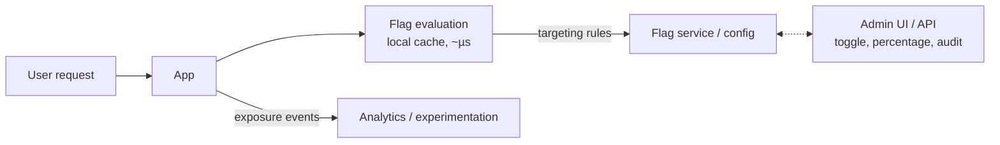

# Feature Flags & Release Management

## What Is It?

A **feature flag** is a decision point in code that changes runtime behavior *without a redeploy*:

```java
if (flags.enabled("one-tap-checkout", user)) {
    return oneTapFlow(user);
}
return legacyCheckout(user);
```

**Release management** is the discipline of controlling *when and how* changes reach users. Flags decouple the two events that older practice fused: **deploying code** and **releasing the feature**.

```text
Old world:  merge → deploy → feature live (one event, all risk at once)
Flag world: merge → deploy (dark) → enable for 1% → 10% → 100% → cleanup
```

## Why Does It Exist?

It's the missing enabler of Trunk-Based Development. TBD required merging incomplete work safely — flags hide it. CD required releasing safely — flags decouple release from deploy. DORA research calls this **decoupling deployment from release**, and elite performers do it on demand, in minutes, without code changes.

## Layer 1 — Simple Explanation

Deploying is **installing the new machinery in the factory**. Releasing is **turning it on**. Old practice welded them together — the machine goes live the moment the last bolt is tight. Flags add a **master switch** (and a dimmer): install quietly, flip on for a few customers, watch, widen, or switch off in seconds if it smokes.

## Layer 2 — Engineer's View

**The flag taxonomy (different flags, different lifespans):**

| Type | Purpose | Lifetime |
|---|---|---|
| **Release flag** | Hide incomplete/new feature | Days–weeks |
| **Ops/kill switch** | Instantly disable a risky path | Permanent |
| **Experiment flag** | A/B test variants | Weeks (until decided) |
| **Permission flag** | Entitlement / tier gating | Permanent (but belongs in product data, not flags) |
| **Config flag** | Tuning (retry counts, thresholds) | Permanent |

The taxonomy matters because **the number one flag pathology is accumulation**: 800 stale release flags, nobody knows which are safe to remove, every code path is `if (flag ? a : b)` combinatorics. The rule: **every flag has an owner and an expiry date**; removal is scheduled work ("flag funerals" — some teams track flags as tech-debt items and enforce via flag-age dashboards).

**Architecture of a flag system:**



Engineering realities:

- **Evaluation must be fast and local** — a network call per decision would add latency everywhere; rules sync to services and evaluate in-memory
- **Consistency:** the same user must see the same variant (deterministic hashing on user ID — not random per request)
- **Kill switches must fail safe:** if the flag service is unreachable, serve the last-known or default state
- **Audit & access control:** a flag can change production behavior — treat the admin API like production access (who flipped what, when, why)

**Progressive delivery — flags + deployment strategies together:**

```text
deploy to canary pods → flag 1% → watch SLOs → flag 10% → 50% → 100% → remove flag
```

Rollback economics: redeploying the old artifact takes minutes; flipping a flag takes seconds. When p95 latency spikes after enabling a flag, seconds matter.

**Release management beyond flags** — the full picture a DevOps engineer owns:

| Mechanism | Controls |
|---|---|
| Flags | Feature visibility, instant rollback of behavior |
| Blue/green, canary | Traffic shift between versions (Deployment Strategies page) |
| Release trains | Cadence for teams without full CD |
| Change freezes | Risk windows (holidays, events) |
| Approval gates | Regulatory/enterprise controls — with the cost of delay |

## Real-World Example (DevOps flavored)

ShopEasy's payments v2 migration — flags carrying a migration:

```text
Week 1:  new payments code deployed, flag "payments-v2" = 0% (dark)
Week 2:  1% internal employees → error budget unchanged → 5% real users
Week 3:  25% → p95 latency +40ms in canary cohort → hold, tune connection pool
Week 4:  100%, old path still in code, kill switch armed
Week 6:  flag funeral — remove "payments-v2", delete legacy path
```

Incident usage: a checkout defect at 14:00 — flag off at 14:02, root-caused at leisure, fix deployed at 17:00, flag re-enabled. MTTR measured in minutes because rollback didn't wait on a pipeline.

Tools you'll meet: LaunchDarkly, Unleash, Flagsmith, FFmpeg-style simple env-var flags (fine to start, wrong at scale — no targeting, no audit, no remote toggling).

## Common Mistakes

- Flag sprawl with no ownership/expiry — the codebase becomes an untestable combinatorial forest
- Flags as config dump — everything tunable, nothing documented
- Non-deterministic bucketing (random per request → users see features flickering)
- Flag state in env vars only — changing them means redeploy, defeating the purpose
- No audit trail — anonymous production changes, compliance nightmare
- Nesting flags — `if a && !b || c` paths never tested; keep flags independent

## Mental Model

> Flags are **circuit breakers on every appliance**. Old houses had one master switch — any fault meant darkness for the whole house. Modern houses break circuits per room: flip the faulty one off in a second, investigate comfortably, restore when fixed. And like breakers, unlabeled panels (flags without owners) are how houses burn down.

## Remember This

1. Flags decouple deploy from release — the CD unlock
2. Taxonomy by purpose; only release/experiment flags are temporary
3. Every flag needs an owner and an expiry; schedule the funeral
4. Deterministic user bucketing; fail-safe evaluation; audit every change
5. Rollback by flag = seconds; rollback by redeploy = minutes
6. Progressive delivery = flags + canary + observability watching the change

## One Sentence

Feature flags separate deploying code from releasing behavior, enabling dark launches, percentage rollouts, and second-level rollback — at the price of disciplined flag lifecycle management.

## Knowledge Check

1. Why do Trunk-Based Development and CD both *require* flags?
2. Your repo has 600 flags. What are the risks, and what's the remediation program?
3. Why must flag bucketing be deterministic per user?
4. Contrast rollback time of a flag flip vs. a redeploy, and when each is appropriate.

## Further Reading

- Martin Fowler's feature-flag articles (taxonomy, Pettichord/Google origins)
- [LaunchDarkly: "What is a feature flag"](https://launchdarkly.com/features/feature-flags/) — vendor-neutral enough on fundamentals
- *Continuous Delivery* — Humble & Farley (release vs. deploy separation)

---

**← Previous:** [Shift Left / Shift Right](shift-left-right.md)
**Next:** [Build Automation](../cicd/build-automation.md) →
**Related:** [Trunk-Based Development](trunk-based.md) · [Deployment Strategies](../cicd/deployment-strategies.md)
