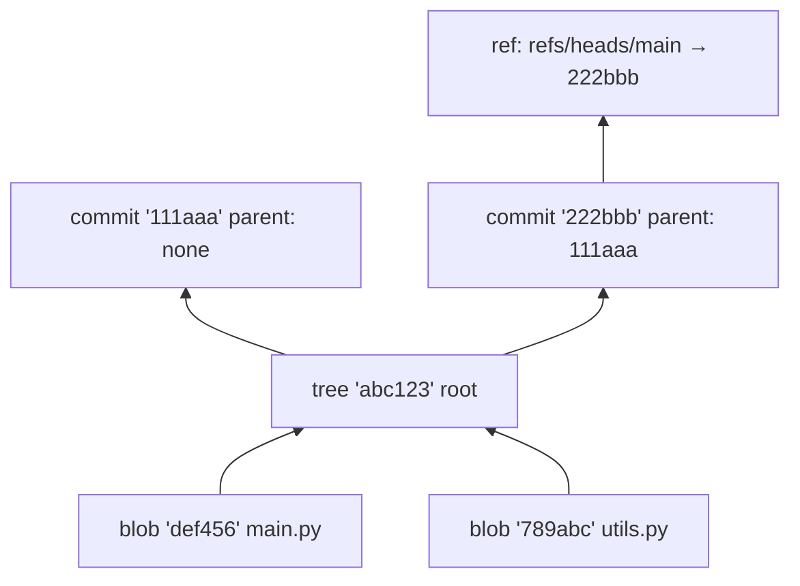

# Git Internals

## What Is It?

Git is a **content-addressable filesystem** with a version-control user interface bolted on top. That's Linus Torvalds' actual design (2005, after the BitKeeper dispute). Understanding the storage model — not the commands — is what separates "I use Git" from "Git has no mysteries for me."

## Why Does It Exist?

Earlier version control (CVS, Subversion/SVN) was **centralized**: one server holds history; every operation needs the network; branching is expensive and slow. In 2005 the Linux kernel community lost access to BitKeeper and needed a system that could:

- Handle thousands of parallel developers, offline
- Make branching and merging trivially cheap
- Be cryptographically tamper-evident (history integrity)

The result: a **distributed** model where every clone contains the complete history.

## Layer 1 — Simple Explanation

Think of Git not as a list of file versions, but as a **photo album of snapshots** where every photo is stamped with a fingerprint of its exact contents.

- Make a change, take a photo → **commit** (a snapshot)
- Each photo records: "I'm the child of photo #12" → **history**
- The fingerprint (SHA-1/SHA-256 hash) means: change one pixel anywhere and it's a *different photo* — accidental or malicious tampering is detectable
- Names like `main` are just **sticky notes pointing at a photo** — that's all a branch is: a movable pointer, 41 bytes

A branch in SVN was a directory copy. A branch in Git is a **pointer**. That's why branching is free.

## Layer 2 — Engineer's View — the object model

Everything in `.git/objects/` is one of four object types, each named by the hash of its contents:

| Object | Contains | Role |
|---|---|---|
| **blob** | File contents (no name, no path) | "Here are the bytes" |
| **tree** | List of entries (name → blob or tree, mode) | "Here's a directory layout" |
| **commit** | Tree hash + parent(s) + author + message | "Here's a snapshot, its ancestry, and why" |
| **tag** | Object hash + tag name + message (annotated) | "Here's a named, signed milestone" |



**Key consequences of content addressing:**

1. **Identical content stored once.** If 1,000 branches contain the same `utils.py`, there's one blob. This is why Git repos are smaller than you'd expect.
2. **History is a DAG, not a line.** Merges create commits with *two* parents. `git log --graph` walks the DAG.
3. **Integrity is built-in.** Every commit embeds its tree hash; every tree embeds its blobs' hashes. Change anything and every hash up the chain changes. This is a Merkle tree — the same idea behind blockchain and BitTorrent.

**Refs and HEAD:**

```text
refs/heads/main      → 222bbb   (branch = pointer to a commit)
refs/tags/v1.0       → 555eee   (tag = named pointer)
HEAD                 → refs/heads/main   ("where am I")
```

`git checkout` moves HEAD and updates your working directory. That's all it fundamentally does.

**The three areas** — the mental model that fixes 90% of Git confusion:

```text
Working Directory  --git add-->  Staging Area (index)  --git commit-->  Repository
     (your files)                  (next snapshot, prepared)              (permanent objects)
```

The staging area exists so one commit can contain a *coherent, reviewable unit* — part of your changes, not all of them.

**Distributed sync:** `fetch` downloads objects and updates *remote-tracking refs* (`origin/main`); `pull` = fetch + merge/rebase. `push` sends objects and asks the server to move its ref. Everything else is local — offline history browsing, local branches, local merges.

## Real-World Example (DevOps flavored)

- **Pipeline clones:** `git clone --depth 1` fetches only the latest commit's objects — the object model explains why shallow clones are smaller and why they can't simply push back full history.
- **CI triggers:** webhooks report a *ref update* ("`refs/heads/main` moved to `222bbb`") — that's literally what a push event is.
- **`.git` size audits:** blobs for committed binaries never die — the object model explains why committing build artifacts or secrets bloats history forever (and why secret removal requires history rewriting).
- **GitOps:** the cluster state you'll later manage with ArgoCD is "deploy whatever commit `environment/production` points to" — a ref as the single source of truth.

## Common Mistakes

- Treating Git as magic and memorizing incantations (`git checkout -- .` without knowing what it touches)
- Confusing `origin/main` (local cache of remote state) with `main` — the #1 source of "where is my branch?"
- Committing secrets/large binaries — objects are forever; use `.gitignore` first, BFG/git-filter-repo for cleanup
- `git pull` on a dirty tree mid-rebase; understand fetch/merge/rebase as separate steps instead
- Believing branching is expensive (that's SVN trauma)

## Mental Model

> Git is a **photo album where every photo is fingerprinted by its content**, branches are sticky notes on photos, and every clone is the whole album. Merging is asking: "how do these two family lines combine?"

## Remember This

1. Git = content-addressable object store (blob, tree, commit, tag) + refs
2. Everything is hashed by content → deduplication + tamper evidence (Merkle tree)
3. A branch is a 41-byte pointer, not a copy — branching is free
4. Three areas: working directory → staging → repository
5. Distributed: fetch/pull/push are ref-sync operations; everything else is local
6. Committed blobs live forever — never commit secrets or binaries

## One Sentence

Git stores snapshots of your entire project as content-hashed objects in a Merkle-DAG, with branches as movable pointers — which is why history is trustworthy and branching is free.

## Knowledge Check

1. Why is a Git branch cheaper than an SVN branch?
2. You modify one line in a 2 MB file and commit. What does Git store?
3. What exactly changes on the server when you push a branch?
4. Why does deleting a file from the working tree not shrink `.git`?
5. Explain `origin/main` vs `main` to a junior engineer.

## Further Reading

- *Pro Git* (book), Chapter 10 — "Git Internals" — the canonical source, free online
- [Git's original design document](https://github.com/git/git/blob/master/Documentation/MyFirstObject.txt) / `MyFirstObject.txt` tutorial

---

**← Previous:** [XP, Lean & SAFe](../software-engineering/xp-lean-safe.md)
**Next:** [Branching Strategies](branching-strategies.md) →
**Related:** [Trunk-Based Development](trunk-based.md) · [Code Review](code-review.md)
