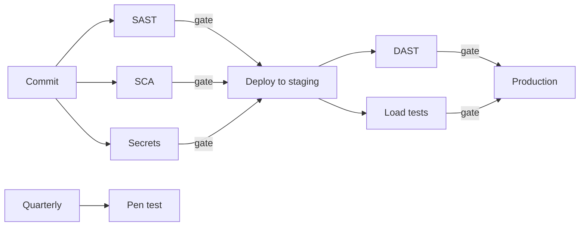

# Performance & Security Testing

## What Is It?

Two test families that functional tests can't replace:

- **Performance testing** — how the system behaves under load, over time, and at limits (latency, throughput, saturation, endurance).
- **Security testing** — how the system behaves under *attack* (probing for exploitable weaknesses).

Both test the **non-functional requirements** from the Requirements page — and both are notorious for being "planned for later" and later never comes.

## Why Do They Exist?

Because functional tests answer "does it work?" — and production answers three more questions: "does it work *fast enough*, for *enough people*, against *someone actively trying to break it*?"

The NFRs (latency targets, capacity, security posture) were the requirements most often unstated. Performance and security testing are how those NFRs get verified instead of assumed.

## Performance Testing — the family

| Type | Question | Method |
|---|---|---|
| **Load testing** | Does it handle expected traffic? | Simulate expected volume |
| **Stress testing** | Where does it break? | Increase load past limits until failure |
| **Spike testing** | What if traffic 10×s suddenly? | Sudden bursts |
| **Soak/endurance** | Does it degrade over days? | Sustained load; watch for leaks, GC death, disk fill |
| **Chaos (cousin)** | What if parts fail? | Inject failures (covered in SRE phase) |

## Layer 1 — Simple Explanation

Functional testing checks the **car drives**. Performance testing checks it **tows a trailer up a mountain in summer without overheating** — and security testing checks that *the door locks actually keep strangers out*, not just that they exist.

## Layer 2 — Engineer's View

**Percentiles, not averages.** The single most important performance-testing skill:

```text
Average latency: 80 ms        ← useless, hides everything
p50: 45 ms   p95: 180 ms   p99: 2,400 ms
```

If 1% of requests take 2.4s and you serve 10M requests/day, that's 100,000 miserable users daily. Your users live in the tail. (These "golden signals" return in the Observability phase.)

**SLOs make load tests pass/fail.** "Latency under load" isn't a result, it's a graph. "p95 < 300 ms at 5,000 rps" is a test. This is why the SLI/SLO concepts (SRE phase) precede meaningful performance engineering.

**Realistic load is hard:** production traffic shapes (read:write ratios, data cardinality, think-times), not naive full-speed loops. Test with production-like data volumes — a query that's instant on 1,000 rows may table-scan on 10M.

**Where it runs:** performance testing needs a production-like environment — the expensive end of the pyramid, run on schedule and on demand (before big releases), not per-commit. Tools: k6, JMeter, Locust, Gatling.

**Security testing — the family:**

| Type | Looks at | Runs | Example tools |
|---|---|---|---|
| **SAST** | Source code, statically | In CI, per commit | SonarQube, Semgrep |
| **SCA** | Dependencies/manifests | In CI, per commit | Dependabot, Trivy |
| **DAST** | Running application | Against deployed env | OWASP ZAP, Burp |
| **Secrets scanning** | Repo/build outputs | Pre-commit + CI | gitleaks, truffleHog |
| **Pen testing** | Everything, by humans | Periodically | External firms |

(Details and pipeline integration in the Security phase; here: *when* each runs and why.) The pipeline pattern — match test to moment:



Cheap static checks per commit; expensive dynamic checks against deployed environments. Same staged-filter economics as the testing pyramid.

## Real-World Example (DevOps flavored)

ShopEasy's Black Friday prep — the canonical performance-testing story:

1. Last year's peak: 8,000 orders/minute at 3× normal latency
2. Target: 20,000/min with p95 checkout < 800 ms (SLO defined first!)
3. k6 scenario ramps to 25,000/min (125% of target — headroom)
4. Findings: connection pool exhaustion at 12k; DB read replica lag at 16k; both fixed, re-tested
5. Result: Black Friday p95 = 610 ms, zero incidents

Without the test, items 4 are discovered *live*, at 12,000 orders per minute, by your on-call.

Your SonarQube experience is the security-side version: quality gates blocking releases on hotspots and CVEs — that's SAST + SCA gating in CI, the shift-left pattern in action.

## Common Mistakes

- Averaging latency — the tail is where customers and incidents live
- Load testing with toy data volumes or uniform traffic
- Testing only the API server, never the database's behavior under contention
- Running DAST only in production (or never) — you need a deployed, disposable target
- Security testing as an annual audit event rather than a pipeline stage
- Confusing "it handled the load once" with "it endures the load" (no soak tests)

## Mental Model

> Functional tests check the **actor knows the lines**. Performance testing is the **full dress rehearsal under stage lights and heat**. Security testing is hiring a **professional burglar to break into your own house** — before a real one does, and while the fixes are cheap.

## Remember This

1. Performance and security tests verify the unstated NFRs — without them, NFRs are fiction
2. Report p95/p99, never averages; users live in the tail
3. SLOs turn performance results into pass/fail gates
4. Family: load, stress, spike, soak | SAST, SCA, DAST, secrets, pentest
5. Staged economics: static-per-commit, dynamic-per-deploy, human-periodic
6. Test with production-like data volumes or don't trust the results

## One Sentence

Performance and security testing verify how the system behaves under load and under attack — the two failure modes functional tests never touch and production always finds.

## Knowledge Check

1. Why does p50/p95/p99 tell you more than the average? Construct a concrete example.
2. Why do SAST/SCA run per-commit but DAST/load tests run per-deployment?
3. What's the difference between load, stress, and soak testing?
4. Your system passed load tests but fell over after 3 days in production. Which test was missing?

## Further Reading

- [k6 documentation](https://k6.io/docs/) — excellent guides on thresholds & scenarios
- [OWASP WSTG — Web Security Testing Guide](https://owasp.org/www-project-web-security-testing-guide/)
- *Release It!* — Michael Nygard (failure modes in production)

---

**← Previous:** [TDD & BDD](tdd-bdd.md)
**Next:** [Shift Left / Shift Right](shift-left-right.md) →
**Related:** [SAST, DAST & SCA](../security/sast-dast-sca.md) · [SLOs & Error Budgets](../sre/slo-error-budgets.md)
