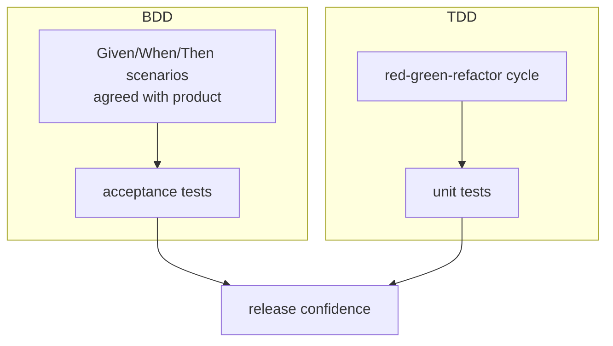

# TDD & BDD

## What Is It?

- **TDD (Test-Driven Development):** write the test *before* the code, in a strict micro-cycle: **red → green → refactor**.
- **BDD (Behavior-Driven Development):** express acceptance criteria as executable scenarios in shared, business-readable language (**Given / When / Then**), so behavior is agreed before it's built.

They answer different questions: TDD is *how developers engineer the inside*; BDD is *how the team agrees on the outside*.

## Why Does These Exist?

Recall the Requirements page: a requirement is real only if testable — "Given/When/Then" bridged requirements to tests. And recall XP: "if testing is good, write tests first."

TDD's logic: if tests are how you'll *know* the code works, writing them first means you specify before you build — the same discipline as blueprints before concrete. BDD extends it across roles: product, QA, and dev agree on scenarios *before* implementation, in a language all three read.

## TDD — Layer 1 — Simple Explanation

TDD is like a **word puzzle where you write the answer key first**:

1. **Red:** write one test for behavior that doesn't exist yet — watch it fail (proves the test can fail)
2. **Green:** write the *minimum* code that passes it — ugly code is fine
3. **Refactor:** clean up now that the tests protect you

Repeat every few minutes. Ten times an hour, all day.

## TDD — Layer 2 — Engineer's View

What TDD actually buys (and what it doesn't):

| Claim | Verdict |
|---|---|
| Produces a test suite for free | ✅ the suite is a by-product |
| Forces small, testable design | ✅ testing pressure shapes decoupled interfaces |
| Defect injection rate drops (studies ~40–80% fewer) | ✅ with discipline |
| Makes bad design impossible | ❌ you can still write rigid designs against mocks |
| Makes you write tests fast | ❌ TDD slows initial coding ~15–30%; it pays at maintenance time |

**The "test-first" discipline enforces testability**: code that's hard to test is hard to change — writing the test first surfaces coupling (to the clock, the DB, the network) when it's cheapest to fix.

**The three laws (Uncle Bob's formulation):**

1. Write no production code except to pass a failing test
2. Write only enough of a test to fail (not compiling counts)
3. Write only enough production code to pass

**Where TDD fits poorly:** exploratory code, gluing external systems, most infrastructure scripts — there the tests come after, and that's fine. TDD is a design tool for domains with clear rules, not a religion for all code.

## BDD — Layer 1 — Simple Explanation

BDD turns the restaurant menu argument into a **script everyone signs before cooking**:

```gherkin
Feature: Repeat customer discount

  Scenario: 10% discount applies
    Given a customer with 2 previous orders
    When they check out a cart of $100
    Then the total charged is $90

  Scenario: First-time customer
    Given a customer with 0 previous orders
    When they check out a cart of $100
    Then no discount applies
```

Product reads it: "yes, that's the rule." Dev reads it: it's a spec. CI reads it: it's an executable test (Cucumber, SpecFlow, Behave). **One artifact, three audiences.**

## BDD — Layer 2 — Engineer's View

BDD's real value is **the conversation before the scenario** — discovery workshops ("three amigos": product + dev + QA). The Gherkin file is the *receipt* of that conversation; teams that skip the conversation and write Gherkin alone get expensive, brittle theater.

**Where BDD lives in the pyramid:** scenarios are integration/E2E-level acceptance tests — the middle and top of the pyramid, deliberately few, tied to business behavior. TDD fills the unit layer beneath.



**Failure mode to know:** step-library sprawl — hundreds of reusable step definitions coupling scenarios to UI internals, so every refactor breaks scenarios. Keep scenarios declarative (business language), push details into page objects / helpers.

## Real-World Example (DevOps flavored)

- Your SonarQube quality gate + unit-test policy is the *enforcement* of pyramid hygiene; TDD is the *authoring discipline* that makes the suite meaningful
- BDD-style acceptance tests are the natural **post-deploy smoke suite** in a pipeline: deploy to staging → run Given/When/Then against the real environment → promote
- IaC testing follows the same grammar mentally: *Given* a VNet with no NSG, *When* `terraform apply` runs, *Then* the plan shows a security-group change (tools: Terratest, OPA policies — later phases)

## Common Mistakes

- TDD as coverage theater: writing all tests first, then all code (batching destroys the feedback loop)
- Testing internals: TDD-ing private methods instead of behavior through public interfaces
- BDD without the conversation — Gherkin written by devs alone = slower E2E tests, zero shared understanding
- Skipping red: a test you've never seen fail may be passing vacuously
- Refactor-phobia: doing red→green without the third step accumulates mess

## Mental Model

> TDD is **tightrope walking with a net you weave one step ahead of yourself** — the net (tests) exists exactly where you're about to step. BDD is the **film storyboard** the director, writer, and editor approve before shooting: expensive scenes (code) get made only against an agreed picture of "done."

## Remember This

1. TDD = red → green → refactor, every few minutes
2. Its real product is *design pressure toward testability*, plus a free suite
3. BDD = Given/When/Then scenarios agreed by product/dev/QA, executable as acceptance tests
4. BDD's value is the conversation; the file is the receipt
5. BDD sits mid/top of the pyramid; TDD fills the base — they're complements, not rivals
6. Never trust a test you haven't seen fail

## One Sentence

TDD engineers the inside of software through a test-first micro-cycle, and BDD aligns the whole team on the outside through executable business scenarios agreed before code.

## Knowledge Check

1. Why does "test first" improve *design*, not just coverage?
2. What is BDD without the three-amigos conversation, and why is it worse than plain E2E tests?
3. Your team TDDs but never refactors (red→green only). What accumulates?
4. Where do BDD scenarios sit in the testing pyramid, and why?

## Further Reading

- *Test-Driven Development: By Example* — Kent Beck (the source)
- [BDD — Dan North's original article](https://dannorth.net/introducing-bdd/)
- [Cucumber documentation](https://cucumber.io/docs/bdd/)

---

**← Previous:** [The Testing Pyramid](testing-pyramid.md)
**Next:** [Performance & Security Testing](perf-security-testing.md) →
**Related:** [Requirements & Work Items](../software-engineering/requirements-work-items.md) · [SAST, DAST & SCA](../security/sast-dast-sca.md)
