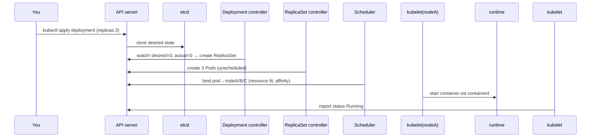

# Kubernetes Architecture

## What Is It?

A cluster is two planes:

```text
┌─────────────────── CONTROL PLANE (the brain) ───────────────────┐
│ api-server   → the single API gateway; everything talks to it  │
│ etcd         → the cluster's database (desired+observed state)  │
│ scheduler    → decides WHICH node runs each pod                 │
│ controllers  → loops that make reality match desire             │
└─────────────────────────────────────────────────────────────────┘
┌───────────────────── NODES (the muscle) ────────────────────────┐
│ kubelet       → the node agent; ensures its pods run/healthy    │
│ kube-proxy    → Services → iptables/IPVS rules                  │
│ container runtime (containerd) → runs containers (OCI page)     │
└─────────────────────────────────────────────────────────────────┘
```

Everything you do — `kubectl apply`, dashboards, CI, GitOps — is just **writes to the API server**, and everything that happens is **controllers and kubelets reacting**.

## Why Does It Exist?

Distributed-systems design decisions, each worth understanding:

- **One API, one store**: all state flows through api-server → etcd. Serialization point for correctness; every component is stateless and replaceable (HA control planes are N replicas + quorum etcd)
- **Level-triggered reconciliation** (from Borg): controllers don't react to events once; they repeatedly compare full desired vs actual state. Missed events? Irrelevant — the next loop iteration catches up. Self-healing follows
- **Declarative objects**: users write *what*, never *how* — enabling GitOps to come later

## Layer 1 — Simple Explanation

The **hospital model**:

- **api-server** = the front desk — every request, record change, and question goes through it
- **etcd** = the medical records room (with backup archives — the *real* memory)
- **scheduler** = the bed-assignment office — which ward (node), which bed, per resources and needs
- **controllers** = the nursing supervisors who walk the wards forever: patient missing? find one. Prescription changed? adjust treatment
- **kubelet** = the ward nurse on each floor — executes and monitors *their* assigned patients
- **kube-proxy** = the internal phone directory operator routing calls to wherever patients currently are

## Layer 2 — Engineer's View

**A deployment's journey through the machinery (trace it once, own it forever):**



No component calls another directly — all through watch-ing the API. That's why K8s is extensible (CRDs are just new object types for *your* controllers — Operators later).

**etcd — know your database (it holds the cluster's soul):**

- Distributed KV store, raft quorum (3 or 5 members — quorum math: tolerate (n-1)/2 failures)
- Its latency gates *every* cluster operation; its disk is the cluster's most precious disk (fsync latency!)
- Backup = `etcdctl snapshot save` — your ultimate recovery (DR page's law applies)
- A cluster without quorum is a cluster that reads-but-cannot-write

**The scheduler's decision inputs:** resource requests (cgroups guarantees — Linux page), affinity/anti-affinity, taints/tolerations, topology spread (AZs), priorities/pod-overhead — bin-packing with constraints (its own page later).

**kubelet — the honest agent (and its blind spot):** kubelet trusts the runtime's word that the container *runs*. Whether the app *works* is liveness/readiness probes — your declaration of health (Troubleshooting page). "Container Running" ≠ "serving traffic"; probes bridge that gap.

**Control plane HA & the managed compromise:** managed K8s (AKS/EKS/GKE) runs HA api-server/etcd for you — you still own: node lifecycle, upgrades cadence, and the blast radius of api-server availability for *your* CI/GitOps (its outage = no changes propagate, though running workloads continue).

**Add-ons completing the picture:** CNI (pod networking — veths from your Linux page), CoreDNS (the DNS page's records), metrics-server (HPA fuel), ingress controllers (the LB/proxy page's pattern).

## Real-World Example (DevOps flavored)

Debugging the machinery itself — the questions map to components:

```bash
kubectl get --raw /healthz?verbose      # api-server's own vitals
kubectl get pods -n kube-system         # control plane pods (on managed: abstractions)
etcdctl endpoint status --cluster -w table   # quorum health, DB size, raft term
kubectl get events --sort-by=.lastTimestamp  # the system's own narrative
kubectl describe pod -‑> Events:       # scheduler decisions, kubelet failures, image pulls
```

The classic diagnosis: "kubectl hangs" = api-server/etcd trouble (check etcd disk + quorum); "pods Pending" = scheduler (resources/affinity); "pod scheduled but not starting" = kubelet/runtime/node.

## Common Mistakes

- 3-node "HA" etcd on the same rack/AZ — quorum meets failure domain (Regions page)
- No etcd backup story because "the cloud manages it" — managed ≠ your data's DR plan
- Starving etcd disks (slow fsync = whole cluster latency)
- Treating node NotReady as a pod problem (it's kubelet/network on the node)
- One mega-cluster with no namespaces/policy boundaries — org design (Team Topologies later) misread as tech

## Mental Model

> The control plane is a **hospital administration where the front desk (api-server), records room (etcd), bed-office (scheduler), and supervisors (controllers) never speak except through written records** — every supervisor endlessly re-reads the chart and fixes reality toward the prescription. The ward nurses (kubelets) just execute and report. You never tell anyone how; you only update the chart.

## Remember This

1. Control plane = api-server + etcd + scheduler + controllers; nodes = kubelet + kube-proxy + runtime
2. Everything is a write to api-server and a controller reacting — no direct component chatter
3. etcd is the cluster's single source of truth: quorum, fast disk, snapshot backups
4. Level-triggered reconciliation: full-state compare loops, immune to missed events
5. kubelet proves "running", probes prove "working"
6. CRDs extend the same machinery — the extensibility that won the ecosystem

## One Sentence

Kubernetes is a watch-driven reconciliation machine: a highly available API server fronting etcd state, with scheduler and controllers deciding placement and converging reality, while kubelets on each node execute — all coordinated exclusively through the API.

## Knowledge Check

1. Trace a `kubectl scale --replicas=5` through every component to a running container.
2. Why does losing etcd quorum stop changes but not running workloads?
3. What exactly does kubelet report, and what does it NOT know about your app?
4. Why do CRDs "just work" as an extension mechanism?

## Further Reading

- [Kubernetes components — kubernetes.io](https://kubernetes.io/docs/concepts/overview/components/)
- etcd docs — disaster recovery
- "Borg, Omega, and Kubernetes" — the design lineage

---

**← Previous:** [Why Orchestration](why-orchestration.md)
**Next:** [Pods](pods.md) →
**Related:** [systemd](../linux/systemd.md) · [Why Orchestration](why-orchestration.md)
