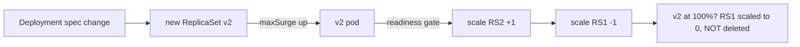

# Deployments & ReplicaSets

## What Is It?

Three layers of the same idea, each answering "who keeps the right pods alive?":

```text
Pod                — one instance (dies alone)
  ↑
ReplicaSet         — keeps N identical pods alive (the replica counter)
  ↑
Deployment         — versions ReplicaSets; rolls out new versions, rolls back
                     (the change manager)
```

You write Deployments almost exclusively; ReplicaSets are their engine; Pods are their output.

## Why Does It Exist?

Recall the reconciliation loop (Architecture page): *someone* must own "desired = 3 replicas of image X". The layered split is deliberate:

- **ReplicaSet**: level-triggered replica maintenance — pod dies → new one, anywhere. But changing its pod template = destructive replace (delete all, recreate)
- **Deployment**: change management *on top* — create a **new** ReplicaSet per version, shift pods between old and new gradually (rolling update), keep history for rollback

That's the CD page's deployment strategies, mechanized: K8s natively implements **rolling** (with surge/unavailable knobs); canary/blue-green ride the same machinery (Argo Rollouts — CD page).

## Layer 1 — Simple Explanation

- **ReplicaSet** = the **staffing agency**: "3 welders on shift" — one quits, agency sends another. It doesn't care *which generation* of welder
- **Deployment** = the **training department**: introduces welders trained on the new manual — 25% at a time — and if the new training proves disastrous, reverts everyone to the previous manual from the file cabinet (revision history)

## Layer 2 — Engineer's View

**The rolling update, mechanically (trace it — this is `kubectl rollout` explained):**

```yaml
strategy:
  rollingUpdate: { maxSurge: 25%, maxUnavailable: 25% }
```



- **Readiness gates the rollout**: a pod that never becomes ready stalls the ramp (maxSurge ceiling) — your app's honest readiness probe is the rollout's safety
- Old RS stays at 0 replicas = **instant rollback path** (`kubectl rollout undo` — re-inflates the old RS; seconds, not pipeline-rerun)
- `progressDeadlineSeconds` + stalled rollouts = the "why won't it deploy" triage: `rollout status`, pod events, readiness

**The Deployment/RS/Pod identity chain you debug through:**

```bash
kubectl rollout status deploy/payments
kubectl rollout history deploy/payments
kubectl rollout undo deploy/payments --to-revision=2
kubectl get pods -l pod-template-hash=...     # which RS owns which pods
```

**Labels & selectors — the glue (worth one careful minute):** everything in K8s connects by *label selection*, not names: RS selects pods by `pod-template-hash`; Services select pods by your labels (next page). Debugging "orphaned pods no one manages" = selector mismatch (template changed without the controller noticing).

**Stateful workloads don't belong here:** Deployments assume pods are interchangeable (cattle). Databases needing stable identity/network/storage get **StatefulSets**; per-node agents get **DaemonSets**; run-to-completion gets **Jobs** (Workloads page next).

**Deployment is also the GitOps unit:** desired replica count, image, and strategy are all declarative fields — which is why ArgoCD (IaC phase) can hold "the cluster should look like this repo" with Deployments as the atoms of change.

## Real-World Example (DevOps flavored)

The rollout stall triage — the rite of passage:

```bash
kubectl rollout status deploy/payments   # "waiting for rollout to finish: 2 of 4 updated"
kubectl get pods                         # new pods: 0/1 Ready, restarts climbing?
kubectl describe pod payments-7d9f-abc   # Events: probe failures? image pull? crash?
# a) readiness failing on dep check (DB migration not run yet) → fix ordering (init container/job)
# b) crashloop → logs → wrong config (ConfigMap page)
# meanwhile traffic still 100% on old RS: rollout stalled = SAFE — by design
```

That last line is the insight: a stalled rollout is the system *protecting you* — old version keeps serving until new proves ready.

## Common Mistakes

- Setting `maxUnavailable: 100%` on customer-facing services (unplanned downtime as policy)
- Rolling without readiness probes = "ready" the instant container starts = deploying broken versions at full speed
- Fighting rollouts with `kubectl set image` directly instead of manifests+Git (GitOps page will formalize)
- Expecting Deployment rollback to fix data (schema migrations rolled forward — CD page's expand/contract)
- `replicas: 1` Deployments for "singleton" stateful apps — update = availability gap; StatefulSet or a lock design

## Mental Model

> ReplicaSet is the **staffing agency** counting identical workers; Deployment is the **training department** phasing in a new generation — ramp up the trained, ramp down the old, keep the old generation's file (RS at 0) for instant rehiring (rollback). Readiness is the graduation exam; a failing exam doesn't break the factory — it just stalls the new generation at the door.

## Remember This

1. Deployment → ReplicaSets → Pods: versioning on top of replication on top of instances
2. Rolling update = shift pods between old/new RS, gated by readiness, bounded by surge/unavailable
3. Old RS scaled-to-0 not deleted = cheap rollback; stalled rollouts are protection, not failure
4. Label selectors connect the layers — mismatch = orphaned pods
5. Stateful/daemon/batch workloads have their own controllers (next page)
6. Deployment fields are declarative — the atom GitOps manages

## One Sentence

Deployments layer change management on ReplicaSets' replica maintenance, turning application updates into readiness-gated rolling transitions between versions with the old generation held at zero replicas as an instant rollback path.

## Knowledge Check

1. Why does `kubectl rollout undo` take seconds while rolling a pipeline back takes minutes?
2. Rollout stalls at "3 of 5 updated". What are the three usual suspects, in check order?
3. What breaks if readiness probes are removed before a big rollout?
4. Why doesn't a database belong in a Deployment?

## Further Reading

- [Deployments — kubernetes.io](https://kubernetes.io/docs/concepts/workloads/controllers/deployment/)
- Next: [Services & Ingress](services-ingress.md)

---

**← Previous:** [Pods](pods.md)
**Next:** [Services & Ingress](services-ingress.md) →
**Related:** [Deployment Strategies (CD)](../cicd/deployment-strategies.md) · [GitOps](../iac/gitops.md)
