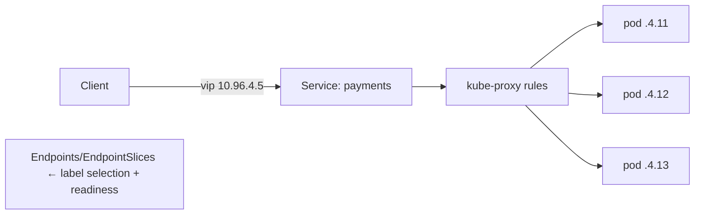

# Services & Ingress

## What Is It?

The networking object ladder — each solves one reachability problem:

| Object | Solves | Analogy (restaurant chain) |
|---|---|---|
| **Service (ClusterIP)** | stable virtual IP+DNS for a *changing pod set*, inside the cluster | the internal extension number for "kitchens" |
| **Service (NodePort)** | expose on every node's IP :port | any branch's front desk phone |
| **Service (LoadBalancer)** | provision a cloud LB in front of the service | the published hotline (cloud-managed) |
| **Ingress** | L7 HTTP routing (host/path → services), TLS | the switchboard: "reservations → desk 2, complaints → desk 5" |

## Why Does It Exist?

Because **pods die and get reborn with new IPs** — the churn Deployments create makes direct pod addressing impossible. The Service is the *stable name* in front of the churn (virtual IP backed by kube-proxy NAT rules — every Networking-page concept, coordinated):



Selection is **label-based + readiness-filtered**: the Service tracks Ready pods matching its selector. Readiness is thus also *traffic gating* (Pods page) — the two systems interlock.

## Layer 1 — Simple Explanation

Pods are **shift workers rotating daily**; you can't publish their personal phone numbers. The Service is the **departmental landline** — dial it, whoever's on shift answers. Ingress is the **building's front desk**: one public entrance, routing by what you ask for ("table for the sushi floor, please"), with a security badge check (TLS) at the door.

## Layer 2 — Engineer's View

**Service types — the progression, with the reasons:**

- **ClusterIP** (default): virtual IP, cluster-internal. DNS: `payments.namespace.svc.cluster.local` (CoreDNS — the DNS page, namespaced). *The* service-to-service primitive
- **NodePort**: opens the same port on every node (30000–32767) → reachability from outside, awkward by design — mostly a building block
- **LoadBalancer**: cloud controller provisions an NLB/ALB targeting the nodes — *one per service*: fine for a few, expensive at scale → the Ingress consolidation
- **ExternalName**: a CNAME alias — service-mesh-lite for external deps

**kube-proxy mechanics (what the VIP actually is):** there is no "service process" — ClusterIP is a *rule set*: iptables (random selection, O(n) rule cost — historically painful at thousands of services) or **IPVS** (hash-based, real LB algorithms). Debugging: `iptables-save | grep payments`, `ipvsadm -Ln`, EndpointSlices, and `curl` from a debug pod.

**Headless Services (`clusterIP: None`)**: DNS returns *pod IPs directly* (A/SRV records) — the stateful-services and client-side-LB pattern (StatefulSets use it; gRPC clients need it — its long connections otherwise glue to one pod).

**Ingress — L7 at the edge:**

```yaml
apiVersion: networking.k8s.io/v1
kind: Ingress
spec:
  rules:
  - host: shop.example.com
    http:
      paths:
      - path: /pay
        backend: { service: { name: payments, port: 8080 } }
  tls: [{ hosts: [shop.example.com], secretName: shop-tls }]
```

- Requires an **ingress controller** (NGINX/Envoy/Traefik — the Reverse-proxy page's pattern; the Ingress object is just its config contract)
- TLS via Secret (cert-manager automates — the TLS page's lifecycle, K8s edition)
- Limits: HTTP-ish only, limited canary/sticky support in the base API → Gateway API (the successor: role-separated, more expressive — track it) or Argo Rollouts integration

**The whole path, assembled (the Networking phase, revisited in K8s vocabulary):**

```text
User → CDN/LB (cloud) → ingress-nginx pod (L7, TLS) → Service VIP (DNAT)
     → ready pod (netns veth) → container
```

Every arrow is a page you've already read.

## Real-World Example (DevOps flavored)

Classic triage: "service returns connection refused":

```bash
kubectl get svc payments            # ClusterIP exists? endpoints?
kubectl get endpointslices -l kubernetes.io/service-name=payments
# EMPTY → selector matches no pods, or pods not Ready (readiness gating!)
kubectl get pods -l app=payments -o wide
# pods exist but 0/1 Ready → probe fails → Service has no targets: fix the probe/dep
# endpoints exist but stale → kube-proxy/EndpointSlice controller lag (check node)
kubectl run tmp --rm -it --image=busybox -- wget -qO- payments:8080/healthz
```

90% of "the service is down" is "the selector matched nothing ready."

## Common Mistakes

- Probing readiness wrongly and wondering why the Service "dropped" pods (feature, not bug)
- A LoadBalancer service per internal app — cloud LB sprawl; ClusterIP+Ingress instead
- Expecting session stickiness from a plain Service (needs sessionAffinity or L7 cookie — or stateless apps, the HTTP page's discipline)
- gRPC through a plain Service load-balancing badly (long-lived connections → headless + client LB, or L7)
- Publishing NodePorts as "the API" — ports-in-URLs operational pain
- Forgetting the ingress controller — an Ingress without a controller is a decorative YAML

## Mental Model

> Services are the **departmental landlines in front of rotating staff** (a virtual number backed by rules that route to whoever's Ready); Ingress is the **front desk**: one entrance, routes by request shape, checks badges (TLS). Underneath, it's still your Linux-page plumbing — veths, NAT rules, DNS records — wearing enterprise clothes.

## Remember This

1. Service = stable VIP + DNS + label-selected, readiness-filtered pod set; implemented by kube-proxy NAT/IPVS
2. Types ladder: ClusterIP (internal) → NodePort → LoadBalancer (one cloud LB each) → Ingress (consolidated L7)
3. Endpoints/EndpointSlices are the truth: empty = selector mismatch or not-Ready
4. Headless for stateful sets + client-side LB (gRPC!)
5. Ingress needs a controller; Gateway API is the successor to track
6. Readiness probes are traffic gates — Service and probe systems interlock

## One Sentence

Services give a stable name and load-distributed virtual IP to a churning set of ready pods, and Ingress layers L7 host/path routing and TLS on top — the cluster's front door and internal directory.

## Knowledge Check

1. Why can't you just use the pod IP in your app's config? (Answer with three pod properties.)
2. "Connection refused" from a Service — walk the three-step triage.
3. Why does one-LoadBalancer-per-service not scale, and what consolidates?
4. What problem do headless services solve for StatefulSets and gRPC?

## Further Reading

- [Service — kubernetes.io](https://kubernetes.io/docs/concepts/services-networking/service/) + Ingress + Gateway API docs
- Next: [ConfigMaps, Secrets & Volumes](config-secrets.md)

---

**← Previous:** [Deployments & ReplicaSets](deployments.md)
**Next:** [ConfigMaps, Secrets & Volumes](config-secrets.md) →
**Related:** [Proxies & Load Balancers](../networking/proxies-load-balancers.md) · [DNS](../networking/dns-dhcp-nat.md)
