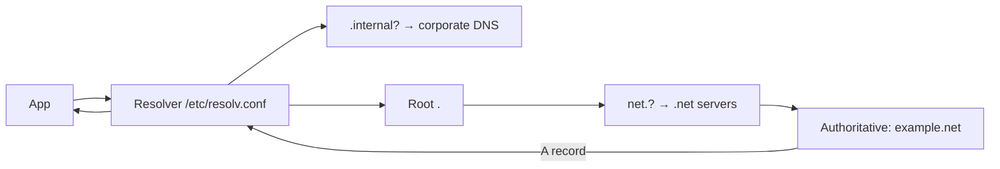

# DNS, DHCP & NAT

Three infrastructure services so ubiquitous you forget they exist — until they break, and everything breaks.

## DNS — the phone book

**What:** maps names (`payments.internal`) to addresses (`10.0.4.12`) — and more (mail servers, load-balancer aliases, service discovery).

**The lookup, end to end:**



Each level *delegates*. The answers are **cached** with a **TTL** (seconds the record may be reused) — the number that makes "I changed DNS but nothing happened" a non-mystery.

**Record types you actually use:**

| Type | Maps | Ops use |
|---|---|---|
| A / AAAA | name → IPv4/IPv6 | the basics |
| CNAME | name → name | aliases (service → LB) |
| MX / TXT | mail / text | email routing; **TXT also: SPF/DKIM + DNS challenges** |
| SRV | name → host:port | service discovery (K8s headless services) |

**Why DNS is the #1 "network" problem (and the toolkit):**

```bash
dig payments.internal +short        # what + only the answer
dig @10.96.0.10 payments.internal   # query a specific server (bypass local config)
dig +trace example.net              # walk the delegation yourself
resolvectl status                   # which resolver am I actually using?
```

The K8s twist: cluster DNS (CoreDNS) serves `<service>.<namespace>.svc.cluster.local` — and resolver search paths make cross-namespace calls resolve differently in vs. outside the cluster. "Works in my namespace, not in yours" is usually a FQDN problem.

**The availability rule:** DNS is a *dependency of everything* — design it redundant, cache aggressively (client-side caches, node-local DNS in K8s), and treat TTLs as an operability knob (low before planned IP changes, high for stability).

## DHCP — the address dispenser

**What:** hands interfaces their IP, mask, gateway, and resolver automatically (Discover → Offer → Request → Ack).

Where you meet it: VNet/subnet defaults in the cloud, home/office networks, and the failure mode — `169.254.x.x` (link-local) means "DHCP failed" (IP Routing page's diagnostic finding). In clouds, DHCP is mostly invisible because static/managed assignment replaces it — the concept survives in the *subnet's* gateway/DNS assignments.

## NAT — the address rewriter

**What:** rewrites packet addresses in flight. The form you live with:

| Type | Rewrites | Where |
|---|---|---|
| SNAT / MASQUERADE | source (private → public) | *every* container/pod egress; home router |
| DNAT | destination (public:port → private host) | exposed services; K8s Service is pure DNAT |
| Port NAT (NAPT) | + port tracking (conntrack) | the default meaning of "NAT" |

The two consequences worth internalizing:

1. **Conntrack is state:** every connection is a table row; tables overflow (the classic `nf_conntrack: table full` node failure under load).
2. **Inbound breaks:** NAT hides initiators — that's why you need DNAT rules, port-forwards, and why peer-to-peer needs hole-punching (STUN/TURN).

## Layer 1 — The Simple Analogy

- **DNS**: the receptionist translating "Accounting, please" to "desk 4.12"
- **DHCP**: the front desk assigning you a desk number on arrival
- **NAT**: the mailroom re-writing return addresses so one public address serves a whole building — and keeping a ledger (conntrack) to route replies back

## Real-World Example (DevOps flavored)

```bash
# "service unreachable in prod"
curl payments.internal        # fails
dig payments.internal +short  # → old IP 10.0.4.11 (TTL not expired or stale record)
dig @10.96.0.10 payments.internal +short  # cluster DNS says 10.0.4.12 — truth
# fix side: wait out TTL / flush node-local cache; process side: fixed the pod that pinned the old IP at startup

# conntrack incident: node drops 5% of new connections under load
dmesg | grep conntrack        # "table full, dropping packet"
sysctl net.netfilter.nf_conntrack_max   # raise + fix the churn source
```

## Common Mistakes

- Long TTLs then emergency IP migrations — you chose the outage window weeks ago
- Debugging DNS as a network problem (or vice versa) — the OSI page's discipline: test by IP and by name
- One DNS server "because it's internal" — the dependency-of-everything service needs redundancy
- Ignoring resolver search-path subtleties in K8s cross-namespace calls
- Forgetting that NAT'd services can't receive unsolicited inbound — design, not bug

## Mental Model

> DNS is the **receptionist** (name → desk), DHCP the **front desk** (assigning desks), NAT the **mailroom with a ledger** (one public address, rewritten envelopes, replies matched back). Fire the receptionist and watch the entire building stop finding each other — that's a DNS outage.

## Remember This

1. DNS: delegated hierarchy + caching with TTL; `dig +short / +trace / @server` are your instruments
2. K8s service DNS names + search paths explain most "only here" resolution bugs
3. `169.254.x.x` = DHCP failure signature
4. NAT = address rewriting backed by conntrack state; DNAT is inbound exposure; Services ARE DNAT
5. DNS is a dependency of everything — redundancy and caching are design requirements

## One Sentence

DNS names machines, DHCP equips them, and NAT lets thousands hide behind one address — three quiet services whose failure modes account for most "the network is down" incidents.

## Knowledge Check

1. You changed an A record; some clients see the new IP, others don't — explain precisely.
2. Why does a Kubernetes Service "just work" as inbound DNAT, and what state makes replies return correctly?
3. Which single dig command tells you whether the problem is the record or the resolver?
4. Why does `nf_conntrack: table full` appear on high-throughput K8s nodes, and what are two fixes?

## Further Reading

- *DNS and BIND* — Liu & Albitz / `man dig`
- [How DNS works (comic)](https://howdns.works/)
- `man 8 iptables-extensions` (SNAT/DNAT/MASQUERADE)

---

**← Previous:** [IP, Subnets & Routing](ip-routing.md)
**Next:** [HTTP & HTTPS](http-https.md) →
**Related:** [OSI & TCP/IP](osi-tcpip.md) · [Linux Networking](../linux/networking.md)
