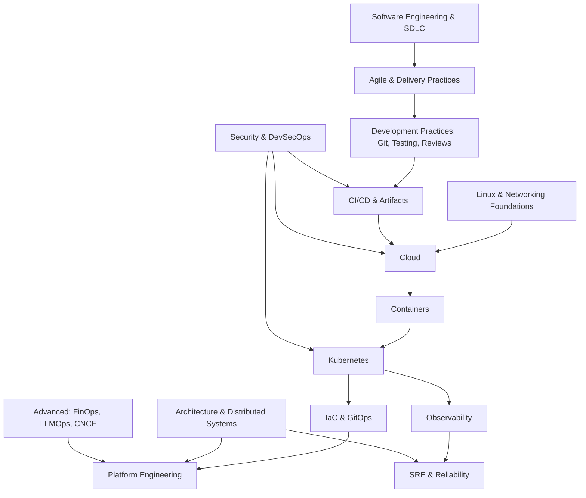

# Learning Roadmap

The complete curriculum — 13 phases, ordered by **dependency**, not by category.
Difficulty: ●○○○○ (easy) → ●●●●● (hard).

## Master concept map

## Phases

| # | Phase | Difficulty | Concepts | Status |
|---|-------|-----------|----------|--------|
| 0 | [Software Engineering & SDLC](software-engineering/index.md) | ●○○○○ | 8 | ✅ 8/8 |
| 1 | [Development Practices](development-practices/index.md) | ●●○○○ | 10 | ✅ 10/10 |
| 2 | [CI/CD & Artifacts](cicd/index.md) | ●●○○○ | 6 | ✅ 6/6 |
| 3 | [Linux Deep Foundations](linux/index.md) | ●●○○○ | 9 | ✅ 9/9 |
| 4 | [Networking](networking/index.md) | ●●●○○ | 9 | ✅ 9/9 |
| 5 | [Cloud](cloud/index.md) | ●●●○○ | 10 | ✅ 10/10 |
| 6 | [Containers & Kubernetes](kubernetes/index.md) | ●●●●○ | 16 | ✅ 16/16 |
| 7 | [IaC & GitOps](iac/index.md) | ●●●○○ | 6 | ✅ 6/6 |
| 8 | [Security & DevSecOps](security/index.md) | ●●●●○ | 14 | ✅ 14/14 |
| 9 | [Observability & SRE](sre/index.md) | ●●●●○ | 11 | ✅ 11/11 |
| 10 | [Architecture & Distributed Systems](architecture/index.md) | ●●●●● | 12 | ✅ 12/12 |
| 11 | [Platform Engineering](platform-engineering/index.md) | ●●●●○ | 8 | ✅ 8/8 |
| 12 | [Capstone Project](projects/index.md) | — | 1 | ✅ 1/1 |
| 13 | [AI Engineering — Zero to Advanced](ai-engineering/index.md) | ●●●●● | 52 | ✅ 52/52 |

## Why this order?

| Decision | Reason |
|---|---|
| Linux & Networking **before** Cloud | Pods, VNets, Services, and Ingress are Linux + networking concepts wearing costumes. |
| CI/CD before Cloud | The pipeline is the story spine; cloud answers "where do we deploy to?" |
| Containers → K8s → IaC/GitOps → Platform Engineering | Each exists because the previous one created a new problem at larger scale. |
| Observability before SRE | SRE is a practice built on signals — you can't manage error budgets without metrics, logs, traces. |
| Security as a vertical track | Core ideas (TLS, IAM) appear in their natural phases; Phase 8 consolidates into DevSecOps. |
| Architecture near the end | HLD/LLD needs all the raw materials: queues, caching, databases, Kubernetes. |

## Phase detail

### Phase 0 — Foundations: how software gets built
Software engineering vs programming · Application lifecycle & SDLC · Requirements & work items · Waterfall and why it broke · Agile · Scrum · Kanban · XP / Lean / SAFe

### Phase 1 — Development practices
Git internals · Branching strategies (GitFlow vs trunk-based) · Code review · SemVer · The testing pyramid · TDD & BDD · Performance & security testing · Test automation · Shift left / shift right · Feature flags

### Phase 2 — CI/CD & artifacts
Build automation (Maven/Gradle) · CI as a concept · Artifact repositories · Deployment vs release · Rolling / blue-green / canary · Pipeline as product

### Phase 3 — Linux deep foundations
Processes & threads · Memory · Filesystems & permissions · Linux networking · systemd · Logs & troubleshooting · **Namespaces** · **cgroups** · Build a "container" by hand

### Phase 4 — Networking
OSI & TCP/IP · IP, subnets, routing · DNS, DHCP, NAT · HTTP/HTTPS · **TLS & certificates** · Proxies & load balancers · Firewalls & VPNs · CDN · API gateway

### Phase 5 — Cloud
Virtualization & what cloud really is · IaaS/PaaS/SaaS/Serverless · Regions & AZs · VPC/VNet · Cloud IAM · Compute options · Storage & databases · Load balancing & autoscaling · Multi-region & DR (RTO/RPO) · Multi-cloud tradeoffs

### Phase 6 — Containers & Kubernetes
Containers (namespaces + cgroups) · Docker images & layers · OCI & runtimes · Registries · Container networking/storage · Why orchestration · Control plane internals · Pods → Deployments → Services/Ingress · Config/Secrets/Storage · StatefulSets/DaemonSets/Jobs · RBAC & Network Policies · Autoscaling · Helm & Operators · Troubleshooting

### Phase 7 — IaC & GitOps
Declarative vs imperative · Mutable vs immutable · Terraform (state, modules, drift) · OpenTofu / Pulumi · Ansible · Drift detection · GitOps pull model (ArgoCD/Flux)

### Phase 8 — Security & DevSecOps
CIA triad · AuthN/AuthZ · RBAC/ABAC · OAuth2 / OIDC / SAML · Zero Trust · PKI & encryption · Secrets management (Vault) · Network security · Cloud security · K8s & container security · SAST/DAST/SCA · SBOM & SLSA · Vulnerability management · Threat modeling · Policy as code · Compliance

### Phase 9 — Observability & SRE
Monitoring vs observability · Metrics & golden signals · Structured logging · Distributed tracing & OpenTelemetry · Prometheus + Grafana · Alerting · SLI/SLO/SLA & error budgets · Toil · Incident management & on-call · Postmortems · Capacity planning · Chaos engineering

### Phase 10 — Architecture & distributed systems
Tradeoffs & architecture thinking · NFRs · Monolith → modular monolith → microservices · Distributed systems fundamentals · CAP & consistency · Event-driven, queues, Kafka · Caching · Replication & sharding · API design · Design patterns & ADRs · HLD & LLD methodology

### Phase 11 — Platform engineering
Why platform engineering · Team Topologies · Developer experience · Golden paths · IDP & portal (Backstage) · Platform as product · Platform metrics · CNCF landscape · FinOps · AI for DevOps & LLMOps

### Phase 12 — Capstone
ShopEasy at 500 engineers — Git + CI/CD + IaC + GitOps + Kubernetes + security + observability + SLOs + golden paths + HLD/LLD + cost model.

## Projects

| Level | After phase | Project |
|---|---|---|
| L1 (30–60 min) | 2, 3, 4 | Full CI/CD pipeline · hand-built container · TCP trace |
| L2 (weekend) | 5–9 | Cloud deploy with IaC · broken-cluster ops · GitOps flow · pipeline hardening · observability + chaos |
| L3 (enterprise) | 10, 12 | ShopEasy HLD/LLD · full capstone platform |
