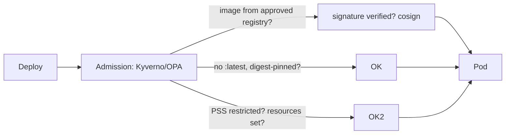

# Kubernetes & Container Security

## What Is It?

Securing the container estate across its **four layers** — each with its own threats and controls:

```text
1. Image      — what's inside the artifact (Supply chain page)
2. Runtime    — what the container can do on the node (this page's core)
3. Network    — what it can reach (done: NetworkPolicies, Zero Trust)
4. Platform   — who controls the cluster (done: RBAC, api-server/etcd)
```

This page assembles the runtime layer (Linux-phase features wearing K8s APIs) plus the cluster hardening checklist.

## Why Does It Exist?

Because of the sentence you learned in the Containers page: **containers share the kernel** — isolation is syscall-boundary strength. The escape path is concrete:

```text
container (root, all caps, no seccomp) → kernel vuln via syscall → node shell →
kubelet creds / cloud role on node → cluster-admin → game over
```

Every control below removes one rung of that ladder. The 2018 "container escape" wave (runc CVEs) made this the standard board-level topic.

## Layer 1 — Simple Explanation

The pod-escape ladder is a **prison break sequence**: get contraband into the cell (bad image), exploit a lazy guard (kernel + no seccomp), reach the guard's keys (node creds), then the warden's office (control plane). K8s security hardens every step: inspecting luggage (image scanning/admission), taking away guard access (non-root + dropped caps), restricting movements (seccomp, gVisor/Kata), locking the key cabinet (node identity), and the warden's office needing its own badge (RBAC).

## Layer 2 — Engineer's View

**The pod security context — the Linux page's hardening, as YAML:**

```yaml
securityContext:
  runAsNonRoot: true; runAsUser: 10001
  allowPrivilegeEscalation: false
  capabilities: { drop: ["ALL"], add: ["NET_BIND_SERVICE"] }   # fine-grained root
  readOnlyRootFilesystem: true
  seccompProfile: { type: RuntimeDefault }
```

**Pod Security Standards** (levels: `privileged`→`baseline`→`restricted`) enforce this per namespace — admission-rejected instead of review-negotiated. Plus the hard no's: `privileged: true`, `hostNetwork/hostPID/hostPath` — each one is a deliberate node-exposure decision that needs sign-off, not a copy-paste.

**The admission gate (where image security meets the cluster):**



Policy-as-code as the bouncer — the Registries page's signature enforcement, implemented.

**The runtime escape hatch options (isolation beyond kernel boundary):**

- **seccomp**: syscall allowlists (RuntimeDefault blocks the historic escape paths)
- **gVisor / Kata** (OCI page): userspace kernel / microVM — VM-grade isolation for hostile multi-tenancy

**Node/control-plane hardening checklist (the audit list):**

- kubelet: `--anonymous-auth=false`, read-only port off, authorization mode Webhook
- api-server: no anonymous/insecure port, audit logging on, RBAC-mode (never ABAC/AlwaysAllow)
- etcd: encrypted at rest + restricted access (it holds all Secrets!)
- Node identity: least-privilege cloud role (the SSRF chain's fuel), IMDSv2
- Upgrades as routine (patched runc/kernel = the escape paths closed) — GitOps/node-lifecycle discipline
- CIS Kubernetes Benchmark via kube-bench — the CSPM-of-clusters

**Secrets handling in-cluster:** the Config/Secrets page's honest accounting — external-secrets + RBAC-scoped access; never `kubectl get secrets` powers for humans where avoidable.

## Real-World Example (DevOps flavored)

The guardrail rollout (how real teams get to `restricted`):

```text
Quarter 1: PSS baseline enforced (warn) → fix violations in charts
Quarter 2: baseline enforce + restricted warn on new namespaces
Quarter 3: restricted enforce everywhere; admission policy: digests only,
           signed images only, no latest, registry allowlist
Audit: kube-bench + quarterly pentest; drift = GitOps selfHeal (can't stay insecure)
```

The measurable: escape attempts (pentest) land in a container with no caps, no seccomp bypass, a seccomp'd syscall surface, scoped SA — and nowhere to go.

## Common Mistakes

- `privileged` or `--cap-add=SYS_ADMIN` to "make it work" (the debugging shortcut that ships)
- Running as root because the base image does — distroless/non-root images fix it at build
- Admission policies written but not enforced — theater (the Registries page's law, again)
- etcd unencrypted/unrestricted — all your Secrets, in one unguarded box
- Skipping node upgrades — holding the kernel/runc escape paths open
- hostPath mounts for "one little file" — node filesystem into the pod

## Mental Model

> Container security is **hardening a prison** you know will receive escape artists: inspect all luggage (image admission), strip guard powers (non-root/caps), restrict movements (seccomp/microVMs), lock the key cabinet (node identity), and badge the warden's office (RBAC). Each control removes one rung — and admission policy makes the ladder *unbuildable*, not merely discouraged.

## Remember This

1. Four layers: image, runtime, network, platform — each previously studied, here assembled
2. Escape ladder: bad image → kernel/syscall → node creds → control plane — remove rungs
3. Pod security context = Linux hardening as YAML; PSS `restricted` enforces it by admission
4. Admission (Kyverno/OPA): digests, signatures, registry, PSS — the bouncer that matters
5. seccomp/gVisor/Kata buy kernel-boundary strength for hostile tenancy
6. Control-plane checklist: no anonymous auth, encrypted etcd, audited api-server, upgraded nodes

## One Sentence

Kubernetes security removes rungs from the container-escape ladder — clean images, stripped capabilities, restricted syscalls, scoped identities, hardened control plane — with admission policy making the insecure states impossible rather than discouraged.

## Knowledge Check

1. Trace the full escape ladder and name the control that breaks each rung.
2. Why does `readOnlyRootFilesystem` + dropped caps matter even with a perfect kernel?
3. Which workloads justify gVisor/Kata, and what do you pay?
4. Why is etcd encryption + access restriction non-negotiable?

## Further Reading

- [Kubernetes docs — security](https://kubernetes.io/docs/concepts/security/) · Pod Security Standards
- CIS Kubernetes Benchmark / kube-bench
- Next: [SAST, DAST & SCA](sast-dast-sca.md)

---

**← Previous:** [Cloud Security](cloud-security.md)
**Next:** [SAST, DAST & SCA](sast-dast-sca.md) →
**Related:** [K8s RBAC & Policies](../kubernetes/rbac-policies.md) · [Capabilities (Linux)](../linux/filesystems-permissions.md)
