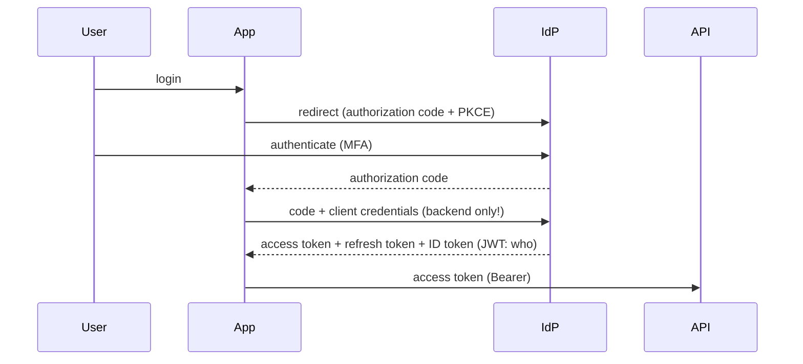

# OAuth 2.0, OIDC & SAML

## What Is It?

The three protocols that move **identity and authorization across trust boundaries**:

| Protocol | Moves | Era/niche |
|---|---|---|
| **SAML 2.0** (2005) | user identity (SSO), XML | enterprises; the incumbent you'll meet, not build |
| **OAuth 2.0** (2012) | **delegated authorization** — "let this app act for me, narrowly" | the web's foundation |
| **OIDC** (2014) | **authentication on top of OAuth 2.0** — who the user is, as JWTs | everything modern |

## Why Does It Exist?

The password-sharing dead-end: every app needing access to your data on another service ("give us your Gmail password") — catastrophic. OAuth's invention: **delegated, scoped, revocable access via tokens** instead of shared credentials:

```text
Resource Owner (you) → authorize → Client (app) gets ACCESS TOKEN (scoped, expiring)
                                   → presents to Resource Server (API)
```

OAuth deliberately does NOT say who the user *is* — OIDC adds the **ID token** (a signed JWT asserting identity) for that. SAML solved the same SSO problem a decade earlier with XML redirects — still running the Fortune 500.

## Layer 1 — Simple Explanation

- **OAuth 2.0** = the **hotel key card**: not your identity — a limited, expiring, revocable card that opens *some* doors (scopes), issued after you prove yourself at the desk
- **OIDC** = the desk also stamping your name on a badge you can show anywhere (**who you are**)
- **SAML** = the old corporate **letter of introduction**, XML-notarized — heavy, universally honored in enterprise-land

## Layer 2 — Engineer's View

**The flows that matter (two):**



- **Authorization Code + PKCE** is the only flow you should build (browser/native apps)
- Client-credentials flow = machines (workload identity — the OIDC federation from the IAM/GitOps pages *is* this flow, where GitHub Actions is the "client")
- The retired flows (implicit, password) exist only in legacy — know them to migrate away

**JWTs — the token format (know it cold):**

```text
header.payload.signature        (base64url; signed, NOT encrypted by default!)
payload: { sub: user-id, aud: app, iss: IdP, exp: ..., scope: "read:orders" }
```

Validation discipline: verify signature, `iss`, `aud`, `exp` — *every* one, every time. The classic CVE pattern: apps verifying signature but not `alg` (the `none`/algorithm-confusion attacks), or not audience.

**Scopes = least privilege, tokenized:** request minimal scopes; treat `scope` like IAM policy granularity. Short-lived access tokens + refresh tokens (revocable at the IdP) — never eternal tokens.

**SAML in one paragraph (enough to operate):** IdP-issued signed XML assertions via browser redirects; the enterprise M&A reality; debugging = SAML tracers + XML signature validation errors. Modern orgs federate: SAML-to-partners, OIDC-internally, everything bridged by the IdP (Entra/Okta) — *identity becomes infrastructure*.

**The DevOps usage you already have:** OIDC federation pipelines→cloud (IAM page), K8s ServiceAccount tokens = OIDC-format JWTs, kubectl OIDC login, ArgoCD/Backstage SSO. Your platforms *speak* these protocols whether you knew or not — now you do.

## Real-World Example (DevOps flavored)

ShopEasy's identity architecture, assembled:

```text
Humans: Entra ID (SSO, MFA) → OIDC → kubectl, ArgoCD, Grafana, Backstage (one login)
Workloads: GitHub OIDC → cloud roles (no stored keys — IAM page)
Service-to-service (internal): mTLS (mesh) for transport + short-lived JWTs for AuthZ
Partners/acquired enterprise: SAML federation where contracts demand
Token rules: 60-min access tokens, scoped per audience, JWKs rotation documented
```

## Common Mistakes

- Storing JWTs believing they're encrypted (they're *signed* — readable by anyone with base64)
- Skipping `aud`/`iss`/`exp` validation — signature-only verification CVEs
- Eternal access tokens; refresh tokens in browsers (the XSS prize)
- Building the implicit/password flows "for simplicity" — the vulnerabilities are the simplicity
- Tokens without audience separation (a token for service A honored by service B)

## Mental Model

> OAuth issues **hotel key cards** — scoped, expiring, revocable; OIDC stamps your **identity on the badge**; SAML remains the **notarized XML letter** enterprises still honor. The IdP is the front desk of the whole internet — and your pipelines, clusters, and dashboards are all guests checking in.

## Remember This

1. OAuth 2.0 = delegated authorization via tokens; OIDC = authentication layer (ID tokens/JWT)
2. Authorization Code + PKCE is the only modern user flow; client-credentials for machines
3. JWT = signed, not encrypted: validate signature AND iss/aud/exp every time
4. Scopes are least-privilege tokenized; short-lived access + revocable refresh
5. SAML = enterprise legacy reality; federate, don't rewrite
6. Workload OIDC federation (CI→cloud, SA tokens) is the same protocol you run for users

## One Sentence

OAuth 2.0 delegates narrow, revocable permissions via tokens, OIDC adds verifiable user identity as signed JWTs on top, and SAML carries the enterprise SSO legacy — together the protocol layer making identity portable across trust boundaries.

## Knowledge Check

1. Why is "OAuth is authentication" wrong, and what does OIDC add?
2. Validate a JWT: list every check, and the attack each check prevents.
3. How is your CI's cloud access the client-credentials flow in disguise?
4. Why must browser apps use PKCE and never see client secrets or refresh tokens?

## Further Reading

- [oauth.net](https://oauth.net/) + RFC 6749/7636/7519 · [OIDC spec](https://openid.net/connect/)
- Next: [Zero Trust](zero-trust.md)

---

**← Previous:** [RBAC & ABAC](rbac-abac.md)
**Next:** [Zero Trust](zero-trust.md) →
**Related:** [Cloud IAM](../cloud/iam.md) · [TLS & Certificates](../networking/tls-certificates.md)
