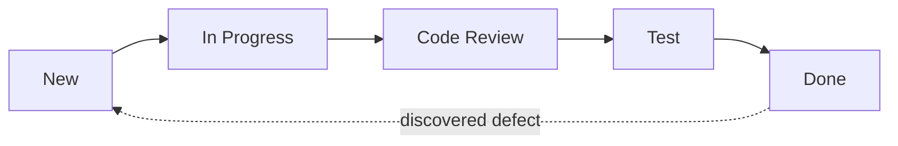

# Requirements & Work Items

## What Is It?

- A **requirement** is a statement of what the software must do (functional) or how well it must do it (non-functional).
- A **work item** is the tracked unit of work created from a requirement — user story, task, bug, epic (Azure DevOps) or issue (Jira/GitHub).

Requirements are the *what*; work items are the *how it flows through the team*.

## Why Does It Exist?

The four engineering questions started with **"What do we build?"** — and history says this is where projects die most often. Studies (CHAOS Report, Standish Group) consistently find the top causes of project failure are requirement-related: incomplete requirements, unclear objectives, changing requirements, and user involvement problems — not technical failure.

The most expensive defect in software is not a bug in code. It is **building the wrong thing correctly**. A wrong requirement shipped perfectly is 100% waste.

## What Problem Does It Solve?

ShopEasy, Year 2. The CEO tells a developer: "We need faster checkout." Three months later, the team delivers an optimized checkout screen. The CEO meant *fewer steps* (2-click checkout). The team meant *lower page-load time*. Both are "faster." Money burned; trust burned.

Also, without work items:

- Work arrives by chat, hallway, and email; priority is whoever shouts loudest
- Nobody knows what's in progress or done
- No history: why was this changed? By whom? For what business reason?

## Functional vs Non-Functional Requirements

| Type | Question | Example |
|---|---|---|
| **Functional** | What does it do? | "Users can pay with PayPal." |
| **Non-functional (NFR)** | How well does it do it? | "Checkout responds in < 500 ms at p95"; "99.9% available"; "AES-256 at rest" |

NFRs are the ones DevOps engineers own in practice: latency, availability, security, recoverability. They are also the ones most often unstated — and untestable until production hurts. (Full treatment in the Architecture phase.)

## Layer 1 — Simple Explanation

Requirements are the **order form**; work items are the **job tickets** on the kitchen rail.

A good order form says what the customer will receive and what "good" means. The kitchen turns each order into a ticket that everyone can see: who's cooking, how long it should take, and when it's done. Tickets with no order form = cooking random food. Order forms with no tickets = chaos in the kitchen.

## Layer 2 — Engineer's View

**The test of a requirement is testability.** The industry standard template is the **user story** with acceptance criteria:

```text
As a returning customer
I want my saved address pre-filled at checkout
So that I can order in fewer steps

Acceptance criteria:
- Given a logged-in returning customer with a saved address,
  when they reach checkout, the address field is pre-filled
- Given a guest user, the field is empty and editable
```

Note the **Given/When/Then** structure — this is deliberately the same grammar as automated acceptance tests (BDD, Cucumber/Gherkin). A requirement written this way can be executed as a test. That's the deep link between "what we build" and CI.

**Work item flow states** mirror the SDLC:



**Traceability, concretely:** work item ID → branch name (`feature/PAY-142-address-prefill`) → commit message (`PAY-142 ...`) → pipeline run → deployment record. Your release notes, audits, and incident forensics all ride on this chain.

**WIP limits and queues:** a board with 40 items "In Progress" is not a board, it's a waiting room. Flow efficiency (time working vs time waiting) is usually < 40% — most of a work item's life is queue time, which is why limiting work-in-progress matters (Kanban will formalize this).

## Real-World Example

Azure DevOps (your daily tool) implements the full hierarchy:

```text
Epic → Feature → User Story / Product Backlog Item → Task / Bug
```

- Epics track initiatives ("One-tap checkout")
- Features track slices ("Saved address service")
- Stories/BUGs are what a sprint consumes
- Tasks are the individual steps (including the pipeline work you do)

## Common Mistakes

- Requirements as solutions ("add Redis") instead of needs ("checkout under 500 ms")
- No acceptance criteria — "done" becomes an opinion
- Unstated NFRs discovered in production incidents
- Work items as micromanagement timesheets rather than flow and traceability units
- Backlog as graveyard: 800 stale items nobody will ever do

## Mental Model

> Requirements are the **contract**; work items are the **tracked parcels** moving through the delivery pipeline. A parcel without a contract is guesswork; a contract without parcels is a wish.

## Remember This

1. Most project failure is requirement failure, not technical failure
2. Functional = what it does; non-functional = how well — DevOps owns the NFRs
3. A requirement is only real if it's testable (acceptance criteria)
4. Given/When/Then bridges requirements to automated tests (BDD)
5. Work items exist for flow visibility and traceability, not surveillance
6. Queue time dominates cycle time — limit work in progress

## One Sentence

Requirements define what to build and how well, and work items are the traceable, trackable units that move that intent through the team's delivery process.

## Knowledge Check

1. Why is the most expensive defect "building the wrong thing correctly"?
2. Which NFRs have you implicitly owned as a DevOps engineer?
3. Rewrite "the system should be fast" into a testable requirement.
4. How does the branch naming convention `feature/PAY-142` create traceability?

## Further Reading

- INVEST criteria for user stories (Independent, Negotiable, Valuable, Estimable, Small, Testable)
- *User Stories Applied* — Mike Cohn
- [Azure DevOps work item documentation](https://learn.microsoft.com/en-us/azure/devops/boards/backlogs/work-items?view=azure-devops)

---

**← Previous:** [Application Lifecycle & SDLC](sdlc.md)
**Next:** [Waterfall](waterfall.md) →
**Related:** [Agile](agile.md) · [Scrum](scrum.md) · [Roadmap](../roadmap.md)
