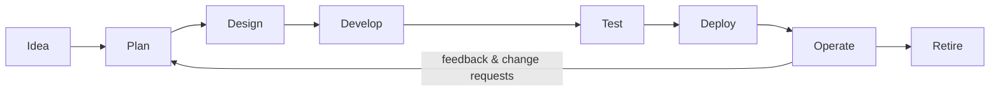
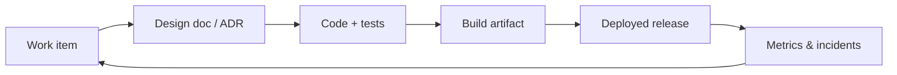

# Application Lifecycle & SDLC

## What Is It?

- **Application lifecycle** is the entire life of a piece of software: from the first business idea, through development and release, through years of operation, until retirement.
- The **Software Development Life Cycle (SDLC)** is the structured model of the *development* portion: the phases an idea passes through to become running software.

## Why Does It Exist?

Once software is delivered, the engineering questions don't stop — they *intensify*. The last concept defined software engineering as answering four questions in a loop:

1. What do we build?
2. How do we build it right?
3. How do we know it works?
4. How do we keep it working?

The SDLC is simply the standard naming of that loop. Teams that don't know the model still follow *some* lifecycle — just an accidental, undocumented, inconsistent one. A shared model lets teams agree on **where a change currently is**, **who owns it now**, and **what gate comes next**.

## What Problem Does It Solve?

Without a defined lifecycle, ShopEasy at 10 developers experiences:

- A "finished" feature that was never tested, deployed, or announced — nobody can say which stage it's in
- Requirements in emails, designs in someone's head, tests written after production incidents
- Every developer following their own personal process
- No common vocabulary: "done" means five different things to five people

The SDLC gives the *same* vocabulary to product, development, QA, and operations — which is a prerequisite for automation (you cannot pipeline a process you haven't defined).

## The Phases (classic model)

| Phase | Question it answers | Typical outputs |
|---|---|---|
| **Planning / Requirements** | What do we build and why? | Business case, requirements, work items |
| **Design** | How should it work? | Architecture (HLD), detailed design (LLD) |
| **Implementation** | Build it | Source code |
| **Testing** | Does it work? | Test plans, defects, quality reports |
| **Deployment** | Ship it | Released artifact, running software |
| **Operations / Maintenance** | Keep it working | Monitoring, incidents, change requests |
| **Retirement** | Turn it off safely | Data migration, decommission plan |

## Layer 1 — Simple Explanation

Think of a restaurant.

- **Plan:** decide the menu (what will customers pay for?)
- **Design:** recipes and kitchen layout
- **Implementation:** cook the dish
- **Testing:** taste it before serving
- **Deployment:** serve the customer
- **Operations:** keep the kitchen running; fix what breaks
- **Retirement:** take the dish off the menu

A restaurant that skips tasting (testing) or serves dishes whose recipes nobody remembers (undocumented design) eventually poisons someone or goes bankrupt. Software is identical, minus the literal poisoning.

## Layer 2 — Engineer's View

**Phases are logical stages, not calendar boxes.** In modern practice (Agile, DevOps), the SDLC is executed in small, rapid iterations — a team may cycle the entire loop weekly or daily. The phases still exist as *gates and artifacts*, not as months-long sequential stages.

**Each phase produces artifacts that feed automation:**

- Work items → drive branch naming, traceability
- Code + tests → drive CI
- Artifacts → drive CD
- Metrics → drive the next planning round

This is the deep reason DevOps exists: **CI/CD is the SDLC with the manual gates replaced by automation.** Your Azure DevOps pipeline is the SDLC executing itself.

**Traceability** is the professional skill: being able to follow one requirement → work item → commits → build → deployment → production behavior. Auditors and incident responders both depend on it.

## Real-World Example

A payment bug at ShopEasy: a customer was charged twice.

- *Without lifecycle traceability:* nobody can find which change caused it; the fix is a mystery hunt through SSH history.
- *With it:* incident → affected version identified from deployment records → work item linked to the change → commit found → fix, test, deploy through the same pipeline in hours.

## Common Mistakes

- Treating "deploy" as the end — operations is typically 60–80% of lifetime cost
- Skipping retirement planning (zombie systems leaking money and security surface)
- Requirements with no acceptance criteria ("make it fast")
- Believing SDLC = Waterfall; the SDLC is the *loop*, Waterfall is one (rigid) way of scheduling it

## Mental Model

> The SDLC is the **assembly line** for software. The application lifecycle is the **entire life of the car** — including every service visit until the scrapyard.

## Remember This

1. Application lifecycle = idea → operation → retirement; SDLC models the development loop
2. The phases are logical gates and artifacts, not calendar stages
3. Every phase's output can feed automation — that's what CI/CD exploits
4. Traceability (requirement → commit → build → deployment) is a core professional skill
5. Operations dominates lifetime cost; deployment is not the finish line

## One Sentence

The SDLC names the repeating phases — plan, design, build, test, deploy, operate — that turn ideas into software that keeps working, and it is the process your pipelines automate.

## Knowledge Check

1. Why can't you automate an undefined lifecycle?
2. Which SDLC artifacts have you already produced in your pipelines?
3. Why is "deploy" not the end of the lifecycle?
4. What does traceability mean, and who uses it?

## Further Reading

- [SDLC — Mozilla Developer / IBM overview](https://www.ibm.com/think/topics/sdlc)
- ISO/IEC/IEEE 12207 — Software life cycle processes (the formal standard)

---

**← Previous:** [Software Engineering](software-engineering.md)
**Next:** [Requirements & Work Items](requirements-work-items.md) →
**Related:** [Waterfall](waterfall.md) · [Agile](agile.md) · [Roadmap](../roadmap.md)
