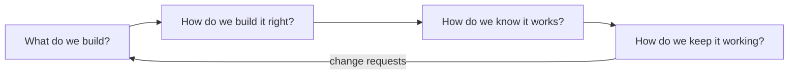

# Software Engineering

## What Is It?

**Programming** is the act of making software work *once*. **Software engineering** is the discipline of making software work *over time, at scale, with many people*.

A widely-quoted modern definition (Titus Winters, Google):

> Software engineering is programming *integrated over time*.

That single word — **time** — explains most of the discipline: versioning exists because of time, tests exist because of future changes, documentation exists because of future readers, CI/CD exists because of future releases.

## Why Does It Exist?

In the 1950s–60s there were only programmers. Programs were small, written by one or a few people, run on one machine, and often rewritten rather than changed.

Then projects like **IBM System/360** (1960s) showed that software complexity explodes with size. Its lead, Fred Brooks, documented the lessons in *The Mythical Man-Month*, including:

> "Adding manpower to a late software project makes it later."

A 1968 NATO conference named the problem the **software crisis** — projects chronically late, over budget, unreliable, and impossible to maintain — and deliberately borrowed the word *engineering* from hardware disciplines to describe what was missing: systematic, disciplined, measurable practice.

Software engineering was born from a **failure**, not from tooling.

## What Problem Does It Solve?

Follow a fictional company, **ShopEasy**:

- **Year 1:** Priya writes the whole shop application. One codebase, one server, she knows every line. Deployment = copying files. Bug? She reads her own code. Works fine.
- **Year 3:** 10 developers. Now:
  - Two people edit the same file and overwrite each other's work
  - Priya left; nobody understands her payment module
  - A "small fix" breaks checkout, and nobody notices for a day
  - Deployments happen over SSH at 11 PM, manually, by whoever remembers the steps

**None of these problems are about writing code.** They are about *coordination, change, knowledge, and repeatability*. Programming skill doesn't solve them; engineering discipline does.

## The Concept, Demystified

Software engineering = three layers stacked on programming:

```text
┌─────────────────────────────────────────┐
│  ENGINEERING DISCIPLINE                 │
│  Processes, practices, tradeoffs,       │
│  measurements, standards                │
├─────────────────────────────────────────┤
│  COLLABORATION                          │
│  Version control, reviews, ownership,   │
│  communication, team structure          │
├─────────────────────────────────────────┤
│  PROGRAMMING                            │
│  Algorithms, languages, data structures │
└─────────────────────────────────────────┘
```

Most DevOps work lives in the top two layers — which is why DevOps engineers are software engineers even when they rarely write application code.

## How It Works

Engineering answers four questions continuously:



1. **What to build** → requirements, work items, prioritization
2. **How to build it** → design, architecture, standards, code review
3. **How we know it works** → testing, CI, quality gates
4. **How it keeps working** → deployment, monitoring, incident response, maintenance

The loop never stops — that is the **application lifecycle**, covered in the next concept.

## Simple Example

Task: *"Add a 10% discount for repeat customers."*

- **Programmer mindset:** `total = total * 0.9` — done in 20 minutes.
- **Engineer mindset:**
  - Which customers count as "repeat"? *(requirement)*
  - Does 10% apply before or after tax? *(edge case)*
  - What if stacked coupons make the total negative? *(failure mode)*
  - Permanent feature or campaign? Should it be configurable? *(change over time)*
  - Test it? Roll out to 5% of users first? Roll back if revenue drops? *(verification & release)*
  - How will on-call know if it breaks checkout? *(operability)*

Same feature, ten times the thinking — and the second version survives production.

## Real-World Example

ShopEasy at Year 5: 50 developers across 6 teams. Engineering is visible as an *infrastructure of practices*:

- Requirements flow through work items (Azure DevOps / Jira boards)
- Every change: branch → pull request → code review → automated tests → quality gate → artifact → pipeline deploys to staging, then production
- Nobody deploys by hand; nobody's laptop builds the release
- A 2 AM latency spike fires alerts, pages an on-call engineer, and ends in a blameless postmortem

No single item is "writing code." Together, they let 50 people change one product every day without chaos.

## DevOps Connection

| Engineering question | Where DevOps answers it |
|---|---|
| How do we know it works? | CI pipelines, SonarQube quality gates |
| How does it keep working? | Deployment pipelines, agents, releases |
| Repeatability | Pipelines replaced manual SSH deploys |
| Knowledge over time | Pipeline YAML is documentation that executes |

## Trade-offs

- **Discipline vs speed:** heavyweight process on low-risk changes is *process theater*. Engineering judgment means making discipline **proportional to risk** — that judgment is the actual skill.
- **Clever vs maintainable:** code is read ~10× more than it is written; optimize for the reader.
- **Building vs operating:** "it works" ≠ "someone else can run, debug, and recover it at 3 AM."

## Common Mistakes

- Treating process as the goal rather than risk management
- Optimizing for elegance over operability
- "I just write the code" — testing, observability, and deployment awareness are part of the job
- Judging engineering by lines of code or hours rather than outcomes over time

## Mental Model

> **Programming is building a sandcastle. Software engineering is running a construction company.**

Or the one-line version to carry through this whole course:

> **Software engineering = programming + time + other people.**

## Remember This

1. Born from a *crisis* (1960s), not from tooling
2. "Programming integrated over time" — time is the key variable
3. Three layers: programming → collaboration → discipline
4. Four eternal questions: what / build right / know it works / keep it working
5. Brooks's Law: adding people to a late project makes it later
6. Discipline must be proportional to risk

## One Sentence

Software engineering is the discipline of keeping software working as it changes, scales, and passes between people over time.

## Knowledge Check

1. Your CTO says: "We have great programmers, so we don't need all this process." What's the flaw, using the *time* idea?
2. A team doubles from 5 to 10 developers and velocity drops. Why, per Brooks?
3. Which of the four engineering questions do CI, SonarQube, and pipelines answer?
4. What is the difference between *process* and *process theater*?

## Further Reading

- *The Mythical Man-Month* — Fred Brooks (1975)
- Titus Winters et al., *Software Engineering at Google* (O'Reilly) — especially "Time and Change"
- [SWEBOK — Software Engineering Body of Knowledge](https://www.computer.org/education/bodies-of-knowledge/software-engineering)

---

**← Previous:** [Start Here](../start-here.md)
**Next:** [Application Lifecycle & SDLC](sdlc.md) →
**Related:** [Roadmap](../roadmap.md) · [Glossary](../glossary.md)
