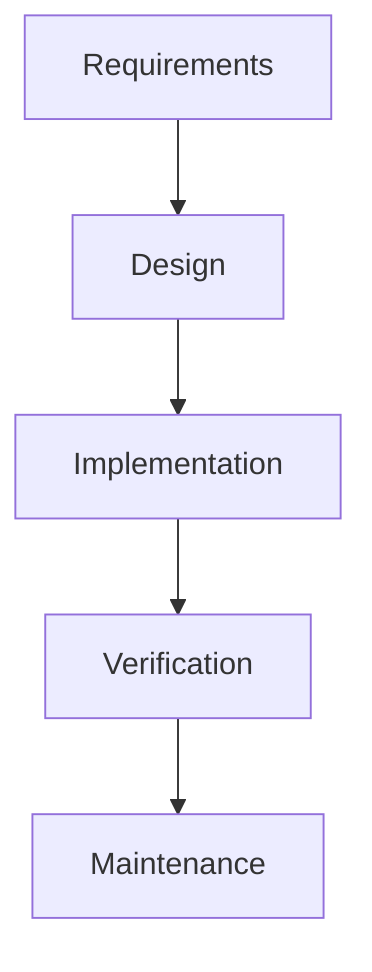

# Waterfall Model

## What Is It?

Waterfall is the original formal SDLC model: each phase completes fully before the next begins, and progress flows one direction — like a waterfall.



Named by Winston Royce (1970) — who, in an irony of history, actually presented it in a paper warning about its weaknesses on large systems.

## Why Does It Exist?

When organizations first tried to industrialize software (1960s–80s), they borrowed from construction and manufacturing: you don't pour the foundation while still designing the roof. Plan everything, then build, then inspect, then hand over.

For its time it was a **huge improvement**: it forced written requirements, design before code, and testing before release. Before Waterfall, many teams had no defined process at all.

It also maps naturally to contract thinking: fixed scope → fixed price → sign-off at each stage. Entire industries (government, defense, enterprise procurement) still run on this logic.

## What Problem Does It Solve?

For ShopEasy's first year — one team, one product, stable requirements — Waterfall works fine:

- Requirements are known and don't move
- The cost of a late change is manageable
- Sequential handoffs are cheap when everyone sits together

## Layer 1 — Simple Explanation

Waterfall is **building a house from approved blueprints**: the architect finishes the plans, you sign, then they build. Changing the bathroom after the concrete is poured costs 50× the original plan.

That's fine for houses. The catch: **software requirements turn out to be nothing like house blueprints** — customers can't fully know what they want until they use something.

## Layer 2 — Engineer's View — why it broke

**1. The requirements fiction.** Waterfall assumes requirements can be fully known upfront. In reality, users discover what they want by using working software. A 12-month project is wrong by month 2, and the model has no feedback loop until delivery.

**2. The cost-of-change curve.** Waterfall's sequential nature makes defects *compound*:

```text
Fix a requirements error during requirements:   1×
Fix it during design:                            10×
Fix it during implementation:                    100×
Fix it after release:                           1000×
```

The defect travels downstream and every phase builds on top of it.

**3. The integration cliff.** Testing happens at the end. Months of work meet reality in one big-bang integration event — historically the graveyard of large projects.

**4. Late risk resolution.** The riskiest questions (does it scale? do users want it?) are answered last, when money is fully spent.

**What survived Waterfall:** phase discipline, sign-offs, documentation, traceability. Agile kept the loop and discarded the one-way flow.

## What Came Next

- **Iterative models** (spiral, RUP) added repetition and risk reduction
- **Agile** (2001 Manifesto) inverted the model: short feedback loops, working software every iteration
- Interestingly, modern CD pipelines give even *Waterfall-style* enterprises feedback loops — the pipeline is a mini-SDLC running on every commit

## Real-World Example

A bank commissions a 2-year Waterfall core-banking replacement. At month 20, user acceptance testing reveals the workflow doesn't match how branches actually operate. Budget is exhausted; the choice is ship-and-suffer or write off two years. This pattern is why the industry moved — and why some regulated domains, accepting the trade-off for auditability and fixed contracts, still choose it deliberately.

## Trade-offs

| Strength | Weakness |
|---|---|
| Strong documentation & audit trail | No feedback until the end |
| Clear contracts and sign-offs | Assumes stable requirements (usually false) |
| Simple to manage and staff | Late testing = expensive defects |
| Works for fixed, well-understood problems | Late risk resolution |

## Common Mistakes

- Blaming Waterfall instead of understanding *why* it fails (one-way flow, late feedback)
- Believing phase sign-offs equal verification — paper approval ≠ working software
- Applying Agile rituals to a contract structure that still forces fixed scope — "Water-Scrum-Fall"

## Mental Model

> Waterfall is **shooting a rocket at the Moon with no course corrections**. Agile is steering the whole way. You can only afford the first approach when you know exactly where the Moon is — and with software, you never fully do.

## Remember This

1. Sequential phases, one-way flow, testing at the end
2. Broke because requirements can't be fully known upfront and defects compound downstream
3. Cost of fixing a requirement error grows ~10× per phase
4. Its disciplines (documentation, traceability, gates) survived into Agile
5. Still valid for fixed, well-understood, contract-driven work — as a deliberate trade-off

## One Sentence

Waterfall executes the SDLC as a one-way sequence of completed phases, and it fails when reality changes mid-flight because it has no feedback loop.

## Knowledge Check

1. Why does the cost of a defect grow ~10× per downstream phase?
2. What assumption does Waterfall make that software reality usually violates?
3. Which Waterfall disciplines did Agile keep?
4. When would you still deliberately choose Waterfall?

## Further Reading

- Winston Royce, *Managing the Development of Large Software Systems* (1970)
- *The Deadline* — Tom DeMarco (novel, seriously)

---

**← Previous:** [Requirements & Work Items](requirements-work-items.md)
**Next:** [Agile](agile.md) →
**Related:** [SDLC](sdlc.md) · [Scrum](scrum.md) · [Kanban](kanban.md)
