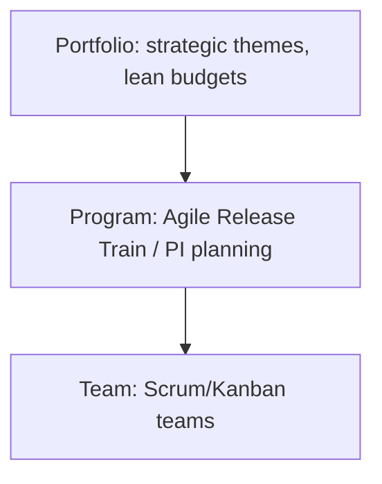

# XP, Lean & SAFe

Three more answers to the same question: *how do we run software engineering at scale?* XP answers at the **engineering-practice** level, Lean at the **thinking** level, SAFe at the **many-teams** level.

## Extreme Programming (XP)

Created by Kent Beck (late 1990s, Chrysler project) — contemporary with Scrum, but focused on **technical practices** rather than process.

**XP's core insight:** if a practice is good, take it to the extreme:

- If code review is good → review *continuously* (**pair programming**)
- If testing is good → write tests *first* (**TDD**)
- If integration is good → integrate *constantly* (**CI** — XP directly seeded the CI movement)
- If short cycles are good → release *in minutes* (continuous deployment avant la lettre)

**The practices:**

| Practice | What it delivers |
|---|---|
| Test-Driven Development | Confidence to change code |
| Pair programming | Real-time review, knowledge spread |
| Continuous integration | Integration risk killed daily |
| Refactoring | Design that stays clean under change |
| Simple design | Less code to be wrong with |
| Collective code ownership | No "priesthood" modules |
| Sustainable pace (40-hour week) | Tired engineers write tomorrow's incidents |

**Why you should care:** Scrum deliberately says nothing about engineering. XP is the missing half — most "Agile failed us" stories are Scrum without XP's practices: sprint theater on top of rotting code. (We adopt XP's practices properly in the Development Practices phase.)

## Lean Software Development

Lean comes from Toyota Production System via Mary & Tom Poppendieck (2003). It's a **way of thinking about waste and flow**, not a process.

**The seven wastes of software** (muda): partially done work, extra features (gold-plating), relearning, handoffs, task switching, delays, defects.

**Lean principles that reappear everywhere in this course:**

| Principle | Where you'll meet it again |
|---|---|
| Eliminate waste | Platform Engineering removing developer friction |
| Build quality in | Shift-left testing, CI quality gates |
| Deciding as late as possible (options) | Feature flags, canary releases |
| Delivering as fast as possible | CD, DORA metrics |
| Empowering teams | Team Topologies |
| Optimizing the whole | Value-stream mapping, avoid local optimization |
| Amplify learning | Feedback loops, experiments |

**Value-stream mapping:** draw every step from idea to production, with wait times. Typical finding: 95% of lead time is *waiting* (approvals, queues, environments), 5% is work. The map shows where to attack — this is the standard opening move of DevOps transformations, and Little's Law from the Kanban page is the math behind it.

**The three "genchi" ideas worth memorizing:**

- **Muda** — waste (non-value-adding work)
- **Mura** — unevenness (batching causes bursts and starvation)
- **Muri** — overburden (unsustainable load → errors)

## SAFe (Scaled Agile Framework)

When 20+ teams work on one product, team-level Agile isn't enough: dependencies, shared platforms, quarterly budgets. SAFe (Dean Leffingwell, 2011) coordinates many Agile teams via **Agile Release Trains (ARTs)** — teams synchronized on a **Program Increment (PI)** cadence (~quarterly planning, ~8–12 weeks).

**Honest assessment:**

- **Why it exists:** large enterprises with regulatory budgets, compliance, and hundreds of engineers need coordination and forecasting. Pure team-level Scrum at that scale creates chaos.
- **The criticism:** it often reintroduces Waterfall properties — PI-level scope commitments, heavy process, top-down planning. Critics call it "Waterfall with sprints."
- **The engineering truth:** SAFe works only when the teams underneath are genuinely Agile *and* technically excellent (CI/CD, test automation). Without the engineering, the framework just schedules the chaos.

Many DevOps engineers in banks/insurers/telcos work inside SAFe organizations — knowing *why* it exists (dependency and budget coordination at scale) helps you improve it rather than just endure it.

## The Big Picture

| Framework | Level of answer | One-liner |
|---|---|---|
| XP | How to build well | Extreme technical practices |
| Lean | How to think | Eliminate waste, optimize flow |
| Scrum | How to run a team | Time-boxed feedback loops |
| Kanban | How to run flow | WIP limits and pull |
| SAFe | How to coordinate many teams | Trains and program increments |

They're not competitors — mature organizations combine them: Lean thinking → team-level Scrum/Kanban → XP engineering practices → scaled coordination where genuinely needed.

## Mental Model

> XP is the **engine**, Scrum/Kanban are the **steering**, Lean is the **driving school**, SAFe is the **traffic system** for a whole city. A city with traffic lights but no engines goes nowhere.

## Remember This

1. XP = engineering practices (TDD, pairing, CI, refactoring) — Scrum's missing half
2. CI was popularized directly out of XP
3. Lean: most lead time is waiting, not working — eliminate waste, optimize the whole
4. Muda/mura/muri: waste, unevenness, overburden
5. SAFe coordinates many teams on a quarterly cadence; valid for enterprise scale, brittle without real engineering practices
6. Frameworks are answers at different levels, not rivals

## One Sentence

XP supplies the technical excellence, Lean the flow-thinking, and SAFe the multi-team coordination that team-level Agile alone doesn't address.

## Knowledge Check

1. Why do "Scrum without XP" teams plateau into sprint theater?
2. Your value-stream map shows 4 months of lead time, 6 days of work. What does Lean tell you to attack first?
3. Which XP practice directly gave rise to CI?
4. What real problem does SAFe solve, and what does it risk reintroducing?

## Further Reading

- *Extreme Programming Explained* — Kent Beck
- *Lean Software Development* — Mary & Tom Poppendieck
- [SAFe framework site](https://scaledagileframework.com) — read critically
- *The Phoenix Project* — Gene Kim (Lean/DevOps novel; the friendliest entry)

---

**← Previous:** [Kanban](kanban.md)
**Next:** [Git Internals](../development-practices/git-internals.md) →
**Related:** [Agile](agile.md) · [Scrum](scrum.md) · [Roadmap](../roadmap.md)
