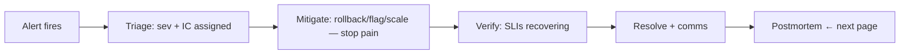

# Incident Management & On-Call

## What Is It?

The practiced system for **detecting, responding to, and resolving** production incidents — with clear roles, communication discipline, and a sustainable on-call rotation. Born from firefighting's Incident Command System (Google imported it into SRE).

**The roles:**

```text
Incident Commander (IC)  — runs the incident: coordinates, decides, NEVER types commands
Ops/Responders           — execute: mitigate, investigate
Comms/Update lead        — status page, stakeholder updates ("we know, we're on it")
Scribe                   — timeline: timestamps every fact (the postmortem's raw material)
Subject experts          — pulled in as needed by the IC
```

## Why Does It Exist?

Because unstructured response is *slower than the problem*:

```text
No IC:    15 people in one channel, everyone debugging, nobody deciding,
          mitigation obvious at min 10 happens at min 55 — and the timeline
          is reconstructed from memory for a postmortem that argues
With IC:  one brain holding state and priorities; mitigation first, diagnosis later;
          stakeholders informed on schedule; timeline captured live
```

The core doctrine: **mitigate > diagnose**. Stop the bleeding (rollback, flag off — the Feature Flags page's seconds-level rollback), then understand. Teams that investigate before mitigating extend user pain for curiosity.

## Layer 1 — Simple Explanation

The IC is the **fire-scene commander**: radio in hand, directing units, never holding a hose personally — because a commander holding a hose has stopped commanding. The comms lead is the **spokesperson to the crowd** (status page — the users' anxiety management), and the scribe the **court reporter** timestamping facts while they're facts.

## Layer 2 — Engineer's View

**The lifecycle:**



**Severity, defined by USER impact (not adrenaline):**

| Sev | Meaning | Response |
|---|---|---|
| SEV-1 | major user impact / data risk | page, IC, war room, exec comms |
| SEV-2 | degraded, workaround exists | page, responders |
| SEV-3 | minor / internal | business hours |

**On-call as an engineered system (the sustainability math):**

| Factor | Practice |
|---|---|
| Rotation size | ≥ 6-8 people/rotation (realistic pages/shift — Alerting page's <2 rule) |
| Compensation | paid, explicitly (overtime or allowance) |
| Handover | written shift-relief doc: open incidents, budget status, landmines |
| Follow-the-sun | for global teams — or accept circadian tax |
| Pages analyzed | every page → postmortem-adjacent review; repetitive pages = automate or fix |
| Toil guard | > 30% toil on rotation → project work to eliminate it (toil is SRE's named enemy) |

**The practices that separate functional teams:**

- **Dedicated channel + bridge per incident** (from a bot template: `#inc-2026-0822-checkout`)
- **Status cadence**: stakeholder updates every 30 min even when nothing changed — silence breeds escalations
- **Explicit escalation paths**: IC stuck 20 minutes → next tier, no ego
- **Blameless from the start**: the timeline records *what happened*, not *who* — the culture begins in the channel, not at the postmortem

## Real-World Example (DevOps flavored)

A SEV-1 done right (the whole course compressed into 40 minutes):

```text
14:00 p95 burn-rate page → 14:03 IC assigned, channel opened, scribe bot live
14:07 deploy at 13:58 identified (trace sampling: payment-svc latency after release)
14:10 MITIGATE: git revert → GitOps sync (ArgoCD page: seconds-level rollback)
14:14 SLIs recovering; status page updated ("identified, fix rolling out")
14:20 budget spent: 11 min of 43 — recorded
14:30 resolved; timeline already written (scribe did it live)
Tomorrow: postmortem (next page) — root cause was the skipped DB index in the release
```

Note who did what: IC never typed kubectl. Responders never wrote updates. The scribe's timeline made tomorrow's postmortem a 30-minute fact-check instead of a debate.

## Common Mistakes

- Hero-debugging as the response model — everyone investigates, nobody mitigates or communicates
- IC typing commands — command attention divided = incident extended
- Silent incidents — stakeholders discovering outages from Twitter
- Timeline from memory at postmortem time — reconstructed fiction
- On-call as unpaid martyrdom — the rotation rots and the best people leave
- Never reducing page count — the system's toil never engineered away

## Mental Model

> Incident response is a **fire-scene command system**: one commander directing (never hose-holding), units mitigating first and diagnosing second, a spokesperson managing the crowd's anxiety on schedule, and a recorder capturing the timeline as it happens. On-call is the **staffing model that keeps firefighters rested enough to think**.

## Remember This

1. Roles: IC (decides, never types), responders, comms lead, scribe
2. Doctrine: mitigate before diagnose — rollback/flag beats understanding, initially
3. Severity by user impact; comms cadence even when unchanged; escalation without ego
4. On-call: ≥6-8 people, paid, handover docs, and pages engineered downward over time
5. The live-captured timeline is the postmortem's raw material
6. Blameless culture starts in the incident channel

## One Sentence

Incident management brings fire-scene command structure to production failures — clear roles, mitigation-first doctrine, scheduled communication, and a live timeline — run by a rested, compensated on-call rotation.

## Knowledge Check

1. Why must the IC never execute commands personally?
2. SEV classification for: 500ms latency regression; checkout down for one region; internal dashboard down. Defend.
3. Design the on-call rotation for a 4-person team with ~3 pages/night. What must change first?
4. Why does "mitigate before diagnose" minimize user pain — and what does it cost?

## Further Reading

- Google SRE book ch. 14 (managing incidents); *Incident Management for Operations* — Schwartz
- Next: [Postmortems](postmortems.md)

---

**← Previous:** [SLI, SLO & Error Budgets](slo-error-budgets.md)
**Next:** [Postmortems](postmortems.md) →
**Related:** [Alerting](alerting.md) · [Kubernetes Troubleshooting](../kubernetes/troubleshooting.md)
