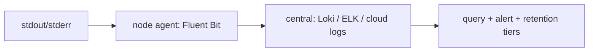

# Logging

## What Is It?

Logs are **discrete, timestamped events** — the highest-detail telemetry pillar. Modern practice: **structured logs** (JSON: fields, not prose), centralized, correlated by IDs, retained per policy.

```json
{"ts":"2026-08-22T14:02:11Z","service":"payments","level":"error","trace_id":"a1b2c3",
 "span_id":"d4e5","user_id":"u-77","route":"/pay","msg":"3ds_challenge_failed","bin":"44xx"}
```

## Why Does It Exist?

Metrics say *which* service, traces say *where* in the journey — logs say **what actually happened**: the exception, the parameter values, the downstream response. They're the debugging pillar; unstructured ("ERROR: something went wrong") they're searchable prose at best.

The pipeline problem you operate: 2,000 pods × logs = a firehose needing collection → centralization → indexing → retention tiers.

## Layer 1 — Simple Explanation

Logs are the **flight recorder**: every event, timestamped, replayable after the crash — unlike the cockpit gauges (metrics) or the flight plan (traces). Structured logging is upgrading from the pilot's diary ("had a bumpy ride somewhere over the Atlantic") to the sensor-data file (altitude=31,000, turbulence=severe, at 14:02:11).

## Layer 2 — Engineer's View

**Structured logging — the field discipline:**

| Rule | Why |
|---|---|
| JSON (or logfmt) — fields | machine-queryable: `service=payments AND trace_id=a1b2c3` |
| levels with meaning | error = someone must look; warn = degraded; info = business events; debug = off in prod |
| correlation IDs in every line | trace_id/user_id — the pillar bridge (Observability page) |
| log *events*, not narration | "payment_rejected reason=fraud_score" not "we couldn't process it because..." |
| never log secrets/PII | logs are the most-copied artifact in the org (masking at emit) |

**The collection pipeline (your infrastructure):**



The container-native insight (Processes page): apps log to **stdout**, the platform collects — files-on-disk logging fights the ephemeral world.

**The economics:** logs are the *most expensive* pillar (volume × retention × indexing). Strategy: tiers (hot 7d for debugging, cold 90d for patterns, archive for compliance), sampling for chatty debug, and *event-driven verbosity* — debug-level enabled dynamically for problem pods (severity dial, not constant firehose).

**The anti-patterns that fill TBs uselessly:** request/response bodies at info; per-line logging in loops; duplicated correlation absent (one service's trace_id ≠ next's = the bridge breaks); logging exceptions without context and vice versa.

**Alerting on logs:** error-rate spikes from log patterns (`rate of "payment_failed" > threshold`) — metrics derived from logs; but prefer emitting the metric explicitly (cheaper) than log-matching at scale.

## Real-World Example (DevOps flavored)

The debug session that demonstrates all three pillars cooperating:

```text
1. Alert: payments error-ratio 2.1% (metric — the pager)
2. Trace a1b2c3: span in fraud-check, 8.2s, retry×3 (trace — where)
3. Logs by trace_id: 3ds_challenge_failed bin=44xx issuer=timeout (log — what)
4. Query: all logs bin=44xx last hour → cluster on issuer → one bank's endpoint slow
5. Fix + postmortem cite: log line, trace, metric graph — one story, three sources
```

## Common Mistakes

- Unstructured prose logs — grep archaeology
- Logging PII/secrets (masked at emit or never; rotating after leak ≠ prevention)
- No correlation IDs — pillars without bridges
- Levels as decoration (everything ERROR, nobody trusts anything)
- Retention as an afterthought — either deleted too early to investigate, or kept forever at compliance-risk and cost

## Mental Model

> Logs are the **flight recorder**: structured fields = sensor data, correlation IDs = the timestamped transcript synchronized with the cockpit video (traces) and the gauges (metrics). The platform is the **retrieval system** — collecting every recorder, indexing by flight number, tiering storage by investigation needs.

## Remember This

1. Structured (fields) + correlation IDs (trace_id) + stdout — the trinity
2. Levels with strict meaning; events not narration; never secrets/PII
3. Pipeline: node agent → central store → query/alert/retention tiers
4. Most expensive pillar — tier retention, sample verbosity, prefer explicit metrics for alerting
5. The three pillars answer together: which (metrics), where (traces), what (logs)

## One Sentence

Logging captures discrete structured events with correlation IDs — the highest-detail telemetry pillar — centralized and tiered so that any incident's "what actually happened" is queryable in minutes.

## Knowledge Check

1. Why must secrets/PII masking happen at emit, not in the pipeline?
2. Design retention tiers for: debugging, pattern analysis, PCI compliance.
3. When should you alert on log patterns vs emitting an explicit metric?
4. Your log volume doubled last month — what's the triage checklist?

## Further Reading

- [12-factor app — logs](https://12factor.net/logs) · Fluent Bit / Loki docs
- Next: [Tracing & OpenTelemetry](tracing-otel.md)

---

**← Previous:** [Metrics & Golden Signals](metrics.md)
**Next:** [Tracing & OpenTelemetry](tracing-otel.md) →
**Related:** [Observability](observability.md) · [journald](../linux/systemd.md)
