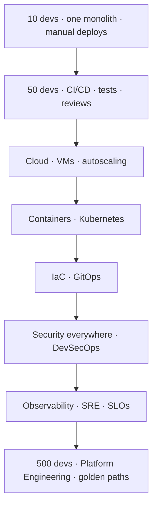

# Start Here

## Who is this for?

You have hands-on DevOps experience — Git, Linux, CI/CD, Docker, Kubernetes, SonarQube,
artifact repositories, Maven/Gradle, shell scripting — but you want to understand the
**engineering underneath the tools**, not just the commands.

## How each concept is taught

Every topic follows the same journey:

```text
Why does this exist?
   ↓
How did engineers survive before it?
   ↓
Why did that break at scale?
   ↓
The concept, demystified
   ↓
How it actually works inside (with diagrams)
   ↓
Simple example → ShopEasy enterprise example
   ↓
What goes wrong in production
   ↓
A mental model you keep for years
```

## Two layers everywhere

1. **Dummies level** — simple enough to explain to a junior engineer.
2. **Engineer level** — architecture, internals, tradeoffs, failure modes, security, and scale.

## The story: ShopEasy

One fictional company grows through the whole course:



## How to use the site

- Follow the **Roadmap** for the recommended order.
- Each finished page links to **previous / next / related** concepts.
- Use the search bar — the site is built to be a long-term reference.
